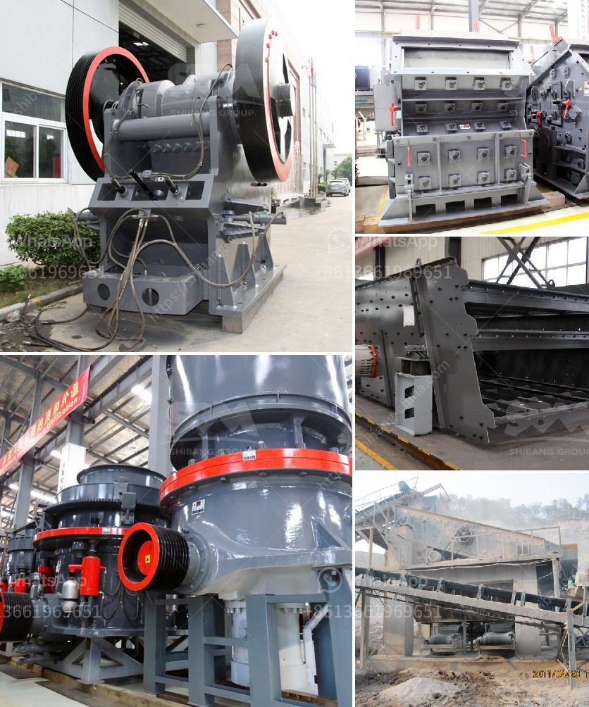

<h3>calcium carbonate grinding technology</h3>
Calcium carbonate is a commonly used mineral compound in many industrial applications, including paper, plastic, rubber, coatings, paints, and construction materials. It is often used as a filler material due to its low cost and abundance in nature. However, to be used effectively, calcium carbonate needs to be ground into fine particles. This is where calcium carbonate grinding technology comes into play.

In the past, traditional Raymond mills and ball mills were used to grind calcium carbonate. However, these methods have several drawbacks. Firstly, the production capacity of these machines is relatively low, resulting in longer processing times for large quantities of calcium carbonate. Secondly, excessive heat generated by these machines during grinding can result in product degradation, reducing the quality of the final material. Finally, these methods are not environmentally friendly, as they consume large amounts of energy and produce high carbon emissions.

To overcome these challenges, modern calcium carbonate grinding technology has been developed, focusing on enhancing performance and efficiency. This technology involves the use of advanced grinding equipment and additives that improve grinding efficiency, reduce energy consumption, and minimize environmental impact.

One of the key innovations in calcium carbonate grinding technology is the development of ultrafine grinding mills. These mills, such as the HCH Ultra-fine Grinding Mill and HLMX Superfine Grinding Mill, are capable of producing fine and ultrafine calcium carbonate powder with a higher grinding efficiency and capacity. They use advanced grinding principles and mechanical shock absorption technology to avoid excessive heat generation during the grinding process, preserving the quality of the final product.

Additionally, the use of grinding aids has become a common practice in calcium carbonate grinding. These additives are chemicals that enhance the grinding efficiency and reduce energy consumption. By decreasing the surface tension of the material being ground, grinding aids facilitate the movement of particles within the mill, leading to a more efficient grinding process. Furthermore, they can also prevent agglomeration and improve the flowability of the powder, enabling easier handling and transportation.

Another aspect of modern calcium carbonate grinding technology is the optimization of the grinding process parameters. By carefully selecting the rotation speed, grinding media size, and filling ratio, operators can achieve the desired particle size distribution, ensuring consistent and high-quality product output. Real-time monitoring systems and automatic control mechanisms also contribute to improved process control and efficiency.

In conclusion, calcium carbonate grinding technology has evolved significantly to meet the challenges of modern industry. Through the use of advanced grinding mills, grinding aids, and optimized process parameters, manufacturers can enhance their production capacity, improve product quality, and reduce environmental impact. As the demand for calcium carbonate continues to grow in various industries, investing in the latest grinding technology is crucial for staying competitive in the market.
<h3>Contact us</h3><ul><li><strong>Whatsapp:&nbsp;<a href="https://wa.me/8613661969651">+8613661969651</a></strong></li><li><a href="https://swt.shibang-china.com/?git&amp;zhl&amp;calcium carbonate grinding technology"><strong>Online Service(chat now)</strong></a></li></ul><h3>Related</h3><ul><li><a href='mobile crushers japan.md'>mobile crushers japan</a></li><li><a href='machinery for magnesium extracted from dolomite.md'>machinery for magnesium extracted from dolomite</a></li><li><a href='conveyor belts for dies.md'>conveyor belts for dies</a></li><li><a href='granite crusher technology.md'>granite crusher technology</a></li><li><a href='ball mills for clay.md'>ball mills for clay</a></li></ul>