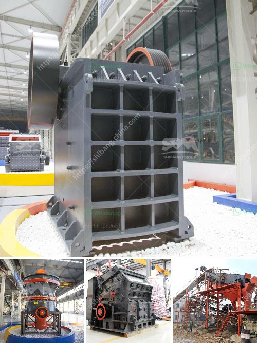

<h3>calcium carbonate manufacturing plant</h3>
Calcium carbonate, widely known as limestone, is a commonly used compound in the construction industry. It has been utilized by countless civilizations throughout history for its versatile properties. Its natural presence in rocks and minerals makes it a cost-effective and environmentally friendly choice for various applications.

The manufacturing plant of calcium carbonate plays a vital role in generating this versatile compound. The production process begins with quarried limestone, which is then crushed and ground to produce fine powder. This powder is further processed to achieve the desired particle size and purity. The manufacturing plant ensures rigorous quality control measures to guarantee the consistency and reliability of the final product.

One of the major applications of calcium carbonate is in the production of cement. It serves as a filler material that enhances the strength and durability of concrete structures. By incorporating calcium carbonate, the construction industry benefits from improved workability and reduced costs. Additionally, the compound contributes to the reduction of carbon dioxide emissions associated with cement production, making it an excellent sustainable choice.

Furthermore, calcium carbonate is widely used as a construction material in its own right. It is a key component of stucco, a type of plaster commonly applied to exterior walls. Stucco provides an attractive and weather-resistant finish to buildings, protecting them from harsh environmental conditions. Its high calcium carbonate content also makes it an excellent insulator, reducing energy consumption for heating and cooling.

In addition to its usage in cement and stucco, calcium carbonate manufacturing plants produce materials for asphalt paving. The compound improves the stability and durability of asphalt roads, making them more resistant to cracking and deformation caused by heavy traffic and adverse weather conditions. These improvements lead to reduced maintenance costs and longer service life for roads, enhancing the overall quality of transportation infrastructure.

Calcium carbonate has also found applications in the construction of buildings and structures. It can be used as a filler material for paints, plastics, and adhesives, enhancing their performance and extending their lifespan. Furthermore, it serves as a buffering agent in the production of drywall and other building materials, maintaining the pH balance and reducing the risk of deterioration.

The calcium carbonate manufacturing plant contributes to the sustainable development of the construction industry. Its production process ensures the efficient utilization of natural resources, reducing waste and carbon emissions. The compound's versatile properties add value to various construction materials, resulting in enhanced performance, longevity, and cost-effectiveness.

In conclusion, the manufacturing plant of calcium carbonate plays a crucial role in meeting the demands of the construction industry. Its production process, quality control measures, and sustainability practices ensure the availability of a reliable and high-quality compound. Calcium carbonate greatly contributes to the strength, durability, and sustainability of cement, stucco, asphalt, and other construction materials. It is a true companion for the construction industry, maintaining the integrity and enhancing the beauty of buildings and infrastructure.
<h3>Contact us</h3><ul><li><strong>Whatsapp:&nbsp;<a href="https://wa.me/8613661969651">+8613661969651</a></strong></li><li><a href="https://swt.shibang-china.com/?git&amp;zhl&amp;calcium carbonate manufacturing plant"><strong>Online Service(chat now)</strong></a></li></ul><h3>Related</h3><ul><li><a href='quarry crusher machine equipment in germany prices.md'>quarry crusher machine equipment in germany prices</a></li><li><a href='kaolin crusher processing plant.md'>kaolin crusher processing plant</a></li><li><a href='secondary cone crusher.md'>secondary cone crusher</a></li><li><a href='how to calculate the operating cost of a stone crusher.md'>how to calculate the operating cost of a stone crusher</a></li><li><a href='crusher machine from south korea.md'>crusher machine from south korea</a></li></ul>