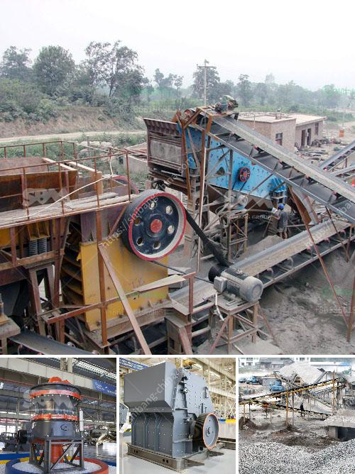

<h3>calcium plant in india</h3>
India, known as the agricultural powerhouse of South Asia, has continually strived to enhance its agricultural yield. Amidst this pursuit, a groundbreaking initiative has gained momentum – the Calcium Plant revolution. Adopted by farmers across the country, this remarkable innovation promises to revolutionize farming practices, increase crop yields, and improve soil health. This article will explore the magnificent potential of the Calcium Plant, its benefits for Indian agriculture, and the future it holds for farmers and the nation as a whole.

The Calcium Plant, which is derived from the mining of calcium carbonate, has emerged as an effective alternative to traditional fertilizers in India's agricultural landscape. This innovative technique primarily involves the direct application of calcium carbonate in the form of powdered limestone or gypsum to enrich the soil. The application of calcium not only enhances soil fertility and macronutrient availability but also helps balance the pH levels, leading to optimized crop growth.

The Calcium Plant intervention has numerous advantages for Indian farmers. Firstly, by improving soil quality, it enhances nutrient uptake by plants, leading to higher yields. Additionally, it helps neutralize the soil's acidity, preventing nutrient lock-up and improving the overall soil structure. As a result, both crop quality and market value are enhanced.

Furthermore, the Calcium Plant technique minimizes the dependence on synthetic fertilizers and reduces their adverse environmental impacts. Substituting these fertilizers with calcium carbonate helps prevent chemical contaminations and minimizes soil erosion risks. This environmentally sustainable approach ensures long-term soil health, promotes organic farming practices, and contributes to the preservation of biodiversity.

The Calcium Plant revolution is rapidly gaining momentum across different states of India. Progressive farmers and agricultural experts have recognized its immense potential to transform the way farming is conducted in the country. This promising initiative is gradually evolving into a vital component of the government's vision to make India self-reliant in food production. With the growing demand for sustainable farming practices, the Calcium Plant initiative is set to play a crucial role in ensuring food security, enhancing farmer income, and promoting a greener and more environmentally-conscious agriculture sector.

The Calcium Plant revolution in India has opened new horizons for sustainable agriculture. By harnessing the benefits of calcium carbonate, farmers across the country are experiencing improved soil health, increased yields, and enhanced agricultural sustainability. With its numerous advantages, this innovative farming technique promises a vibrant future for Indian agriculture – one that is environmentally-friendly, economically lucrative, and socially empowering.
<h3>Contact us</h3><ul><li><strong>Whatsapp:&nbsp;<a href="https://wa.me/8613661969651">+8613661969651</a></strong></li><li><a href="https://swt.shibang-china.com/?git&amp;zhl&amp;calcium plant in india"><strong>Online Service(chat now)</strong></a></li></ul><h3>Related</h3><ul><li><a href='quartz crusher prices.md'>quartz crusher prices</a></li><li><a href='quartz powder making.md'>quartz powder making</a></li><li><a href='ball mill for sale south africa.md'>ball mill for sale south africa</a></li><li><a href='quarry equipment for sale in indonesia.md'>quarry equipment for sale in indonesia</a></li><li><a href='hammer crusher dimension.md'>hammer crusher dimension</a></li></ul>