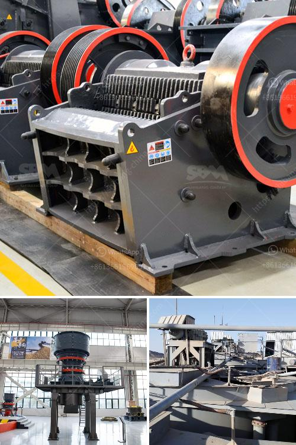

<h3>calculation of production mobile crushers</h3>
When it comes to purchasing a mobile crusher, it is important to calculate its production capabilities to ensure it meets your specific needs. Determining the production capacity of a mobile crusher can be a complex task as many factors contribute to the final output. This article will explore the key considerations and steps involved in calculating the production capacity of mobile crushers.

The production capacity of a mobile crusher is typically measured in tons per hour (TPH). This value indicates how many tons of material the crusher can process within an hour. It is essential to consider several factors that may affect the production capacity, including the feed size, material type, crushing chamber design, and power utilization.

Firstly, the feed size plays a crucial role in determining the production capacity. Mobile crushers are designed to accept various materials, and the maximum feed size that a crusher can handle affects its performance. Larger feed sizes may require a larger crusher to achieve the desired production capacity. It is important to consult the manufacturer's specifications to identify the maximum feed size and choose a crusher accordingly.

Secondly, the material type also impacts the production capacity. Different materials have varying characteristics, such as density, hardness, and moisture content, which influence how efficiently they can be crushed by a mobile crusher. For example, softer materials are generally easier to crush, leading to higher production capacity compared to harder materials. It is crucial to select a crusher capable of handling the specific material type you intend to process.

The crushing chamber design is another factor that affects the production capacity of a mobile crusher. The size and configuration of the crushing chamber, including the throat opening and chamber profile, determine the crusher's capability to crush and discharge material efficiently. A well-designed crushing chamber can enhance the crusher's production capacity and ensure better performance.

Additionally, power utilization plays a critical role in calculating the production capacity of mobile crushers. Power consumption is influenced by various factors, including crusher design, operational settings, and feed characteristics. It is essential to optimize the crusher's power utilization to maximize its production capacity. The manufacturer's guidelines and expert advice can help determine the ideal operational settings for achieving the desired production capacity.

To calculate the production capacity of a mobile crusher, you need to take into account all the aforementioned factors. Begin by identifying the maximum feed size and material type. Then, select a crusher with the appropriate crushing chamber design and ensure optimal power utilization. Lastly, refer to the manufacturer's specifications to determine the crusher's estimated production capacity.

In conclusion, calculating the production capacity of mobile crushers is a vital process in determining whether a crusher is suitable for your crushing needs. Considering factors such as feed size, material type, crushing chamber design, and power utilization is essential to ensure accurate calculations. By following the steps outlined in this article, you can make an informed decision when selecting a mobile crusher for your operations.
<h3>Contact us</h3><ul><li><strong>Whatsapp:&nbsp;<a href="https://wa.me/8613661969651">+8613661969651</a></strong></li><li><a href="https://swt.shibang-china.com/?git&amp;zhl&amp;calculation of production mobile crushers"><strong>Online Service(chat now)</strong></a></li></ul><h3>Related</h3><ul><li><a href='operation hammer mill.md'>operation hammer mill</a></li><li><a href='supplier of granite crusher.md'>supplier of granite crusher</a></li><li><a href='sand washing machine price.md'>sand washing machine price</a></li><li><a href='cement clinker grinding plant india.md'>cement clinker grinding plant india</a></li><li><a href='flow chart of three stage agreegate crushing plant.md'>flow chart of three stage agreegate crushing plant</a></li></ul>