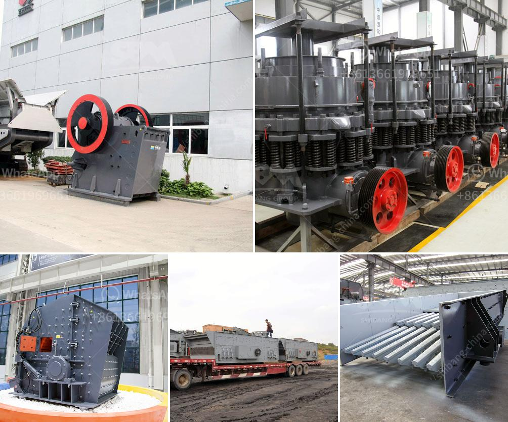

<h3>canyon hammer mills</h3>
Canyon hammer mills have gained popularity in various industrial sectors for their unmatched performance and reliable grinding capabilities. These mills are designed to crush or grind various materials into fine particles or powders, providing substantial benefits to industries such as mining, manufacturing, agriculture, and many more.

With their robust construction and innovative features, Canyon hammer mills offer superior durability and efficiency. Built using high-quality materials and components, these mills are designed to withstand heavy-duty applications and harsh operating conditions. This ensures that they can handle the most demanding tasks without compromising their performance.

One of the key advantages of Canyon hammer mills is their versatility. These mills can effectively grind a wide range of materials, including grains, minerals, chemicals, and even waste products. This flexibility allows industries to process different materials using a single machine, eliminating the need for multiple equipment and reducing costs.

Moreover, Canyon hammer mills are known for their efficient grinding capabilities. Equipped with powerful motors and advanced grinding mechanisms, these mills deliver consistent and uniform grinding results. The adjustable grinding settings enable users to achieve the desired particle size, making them suitable for various applications. Whether it is pulverizing grains for animal feed or reducing large rocks into fine powders, these mills ensure efficiency and quality in every operation.

Furthermore, Canyon hammer mills are designed with user convenience in mind. They feature user-friendly controls and easy maintenance access, allowing operators to operate and maintain the machine with ease. Regular maintenance and quick access to internal components ensure optimal performance and extended lifespan.

In conclusion, Canyon hammer mills provide efficient and reliable grinding solutions for various industries. With their sturdy construction, versatile grinding capabilities, and user-friendly features, these mills are a valuable asset in any production line. Whether it is for processing grains, minerals, chemicals, or waste products, Canyon hammer mills deliver consistent and high-quality results.
<h3>Contact us</h3><ul><li><strong>Whatsapp:&nbsp;<a href="https://wa.me/8613661969651">+8613661969651</a></strong></li><li><a href="https://swt.shibang-china.com/?git&amp;zhl&amp;canyon hammer mills"><strong>Online Service(chat now)</strong></a></li></ul><h3>Related</h3><ul><li><a href='jaw crushing plant.md'>jaw crushing plant</a></li><li><a href='crusher plant supplier in srilanka.md'>crusher plant supplier in srilanka</a></li><li><a href='alluvial wash plants in south africa.md'>alluvial wash plants in south africa</a></li><li><a href='maintenance of raymond mill.md'>maintenance of raymond mill</a></li><li><a href='material of mantles ball mills.md'>material of mantles ball mills</a></li></ul>