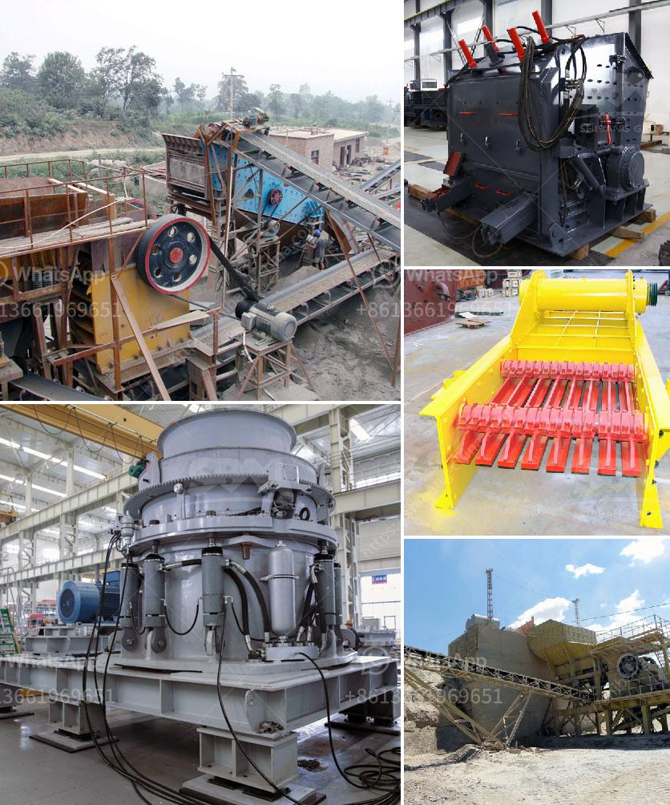

<h3>capacity of the ball mill and rod mill</h3>
When it comes to grinding equipment, the most important point that we need to consider is the capacity of the mill. It is essential to ensure that the plant has enough capacity to meet the production targets efficiently.

Different types of mills have different capacities. The ball mill and rod mill are both long cylindrical grinding machines, which are equipped with a certain number of grinding media (steel balls or steel rods). In the cylinder, the grinding material is squeezed by the steel balls or steel rods in a cascading motion to crush and grind the material.

Both mills are applicable for grinding ores and other materials with a hardness of 6-9 on the Mohs' scale. They can be used in various production lines such as metal and non-metal mines, construction, and chemical industries.

The ball mill and rod mill have different capacities. For example, the capacity of ball mill ranges from 0.65t/h to 615t/h, while the capacity of rod mill ranges from 0.62t/h to 48t/h. Despite the difference in capacity, the two grinding mills share the same working principle and both have hollow cylindrical shells filled with grinding media of different specifications.

The main factors affecting the capacity of the mill are the feed rate, grinding media size, material properties, and liner design.

The feed rate: The higher the feed rate, the greater the grinding capacity of the mill. However, too high a feed rate may cause the material to agglomerate and affect the grinding efficiency.

Grinding media size: The size of the grinding media directly affects the grinding efficiency and grinding capacity of the mill. Larger grinding media can crush and grind larger particles, resulting in higher productivity. However, the size of grinding media should be selected according to the particle size requirements of the final product.

Material properties: Different materials have different hardness and grindability, which directly affect the capacity of the mill. Harder materials require more energy to be ground and may reduce the mill's capacity.

Liner design: The shape and material of the mill liner can affect the grinding capacity of the mill. Smooth and efficient liners can increase the mill's capacity, while worn or poorly designed liners may decrease the mill's capacity.

In conclusion, the capacity of the ball mill and rod mill depends on the feed rate, grinding media size, material properties, and liner design. These factors should be considered when selecting the appropriate grinding equipment for a specific application. Ultimately, the capacity of the mill should be determined based on the production targets and the specific requirements of the material being processed.
<h3>Contact us</h3><ul><li><strong>Whatsapp:&nbsp;<a href="https://wa.me/8613661969651">+8613661969651</a></strong></li><li><a href="https://swt.shibang-china.com/?git&amp;zhl&amp;capacity of the ball mill and rod mill"><strong>Online Service(chat now)</strong></a></li></ul><h3>Related</h3><ul><li><a href='kaolin mining india.md'>kaolin mining india</a></li><li><a href='big stone quarry business plan pdf.md'>big stone quarry business plan pdf</a></li><li><a href='jaw crusher machine in saudi.md'>jaw crusher machine in saudi</a></li><li><a href='pulverizer for carbon black.md'>pulverizer for carbon black</a></li><li><a href='impact crushers manufacturers.md'>impact crushers manufacturers</a></li></ul>