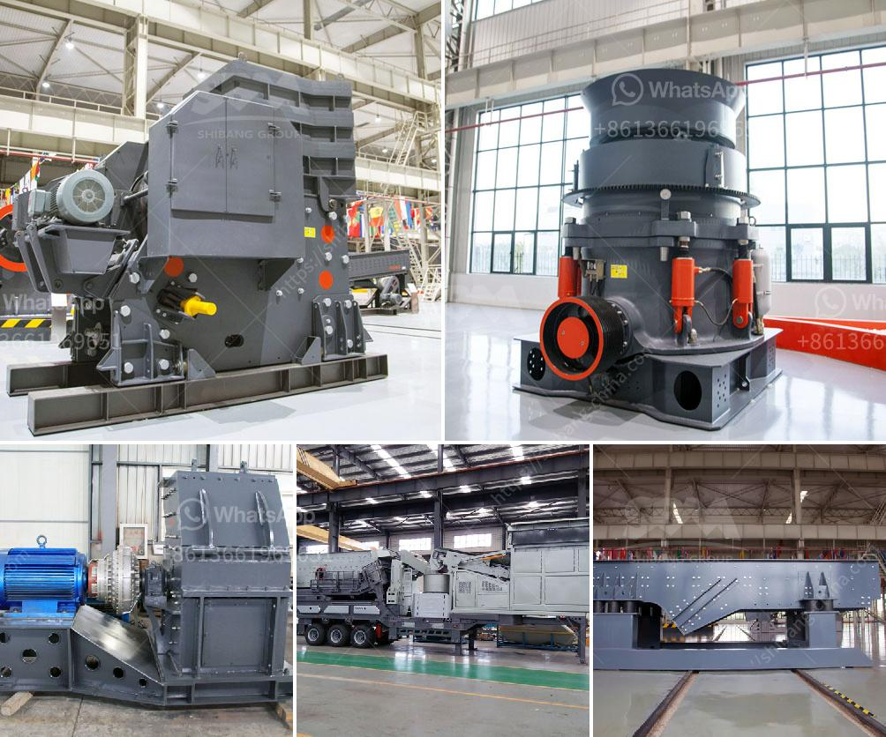

<h3>catalog of vertical grinding mill pdf</h3>
A catalog of vertical grinding mill PDF can be found on the website of the manufacturer. It is a comprehensive file that includes all the necessary information about the product such as technical specifications, sizes, applications, and performance characteristics. This article will discuss some key aspects of vertical grinding mills and how they are used in various industries.

Vertical grinding mills, also known as roller mills, are becoming more and more popular in industries like cement, mining, and power generation. They offer advantages over traditional ball mills, such as higher energy efficiency, lower operating costs, and reduced maintenance requirements. The vertical design allows for gravity-based material flow, which improves grinding efficiency and enables the use of smaller grinding media.

The catalog of a vertical grinding mill PDF provides a detailed overview of the design features and technical specifications of the mill. It typically includes information about the capacity, power requirements, and dimensions of the equipment. This allows potential buyers to assess whether the mill is suitable for their specific needs and requirements.

One of the key advantages of vertical grinding mills is their ability to grind materials with higher moisture content. Traditional ball mills require the material to be dried before grinding, which can be a time-consuming and energy-intensive process. Vertical mills, on the other hand, can handle moist materials up to 20% moisture content, reducing the need for additional equipment and associated costs.

The catalog also highlights the different sizes of vertical grinding mills available. The size of the mill determines its capacity and performance characteristics. Smaller mills are suitable for pilot-scale or laboratory applications, while larger mills are used for industrial-scale production. The catalog provides information on the capacity range of each mill size, allowing users to select the appropriate mill for their specific production requirements.

Another important aspect covered in the catalog is the range of applications for vertical grinding mills. These mills are widely used in the cement industry for grinding raw materials, clinker, and cement additives. They are also used in the mining industry for grinding ores and minerals. In the power generation industry, vertical mills are used for grinding coal and petcoke for fuel preparation. The catalog provides details on the suitability of the mill for each application, including information on the specific type of material that can be ground.

In conclusion, a catalog of vertical grinding mill PDF is a valuable resource for anyone looking to understand and evaluate vertical grinding mills. It provides detailed information about the design, technical specifications, sizes, and applications of the mill. By using the catalog, potential buyers can make informed decisions about which mill is most suitable for their specific needs. With their numerous advantages, vertical grinding mills are becoming increasingly popular in various industries, and a catalog provides all the necessary information to explore the benefits they offer.
<h3>Contact us</h3><ul><li><strong>Whatsapp:&nbsp;<a href="https://wa.me/8613661969651">+8613661969651</a></strong></li><li><a href="https://swt.shibang-china.com/?git&amp;zhl&amp;catalog of vertical grinding mill pdf"><strong>Online Service(chat now)</strong></a></li></ul><h3>Related</h3><ul><li><a href='linear vibrating screen specifications.md'>linear vibrating screen specifications</a></li><li><a href='basalt rebar production line.md'>basalt rebar production line</a></li><li><a href='marble grinding machine bosch make.md'>marble grinding machine bosch make</a></li><li><a href='silica sand grinding machine cost.md'>silica sand grinding machine cost</a></li><li><a href='equipment for limestone mine.md'>equipment for limestone mine</a></li></ul>