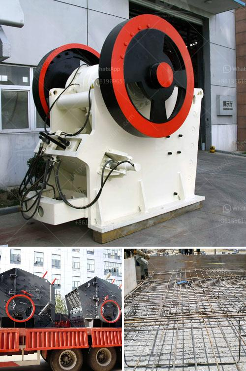

<h3>cement clinker grinding plant cost</h3>
Cement clinker grinding plant cost is a crucial part of the cement production process. It influences the overall cost of the final cement product. The cement clinker grinding plant cost is mainly composed of a crusher, a raw mill, a cement mill, a coal mill, a separator, a bag filter, and other auxiliary equipment. The cost of building a cement clinker grinding plant can vary greatly depending on the different equipment used.

The cement kiln is the main equipment for cement grinding plant, and the whole process of turning raw materials into clinker requires a lot of energy. Therefore, it is crucial to choose an efficient and energy-saving cement kiln as the main equipment for the cement plant. The cost of a cement kiln largely depends on its capacity, speed, and type of fuel used. Generally, a larger kiln with higher capacity will result in higher cost.

Another key component of the cement clinker grinding plant cost is the raw mill. This machine grinds the raw materials into particles that are suitable for cement production. The cost of a raw mill mainly depends on its capacity and the type of material it grinds. High-quality raw mills are usually more expensive, but they can help to increase production efficiency and reduce energy consumption.

The cement mill is responsible for grinding cement clinker, gypsum, and other additives used in cement production. The cost of a cement mill usually depends on its capacity and the type of material it grinds. High-quality cement mills are more efficient and have a lower energy consumption. They also tend to have a longer lifespan, which can help to reduce maintenance and replacement costs in the long run.

A coal mill is often required to grind coal for the kiln, and it plays an important role in the cement clinker grinding plant cost. The coal mill uses hot air to transport and dry the coal particles, and it is important to choose a reliable coal mill to ensure the stable operation of the kiln. The cost of a coal mill varies depending on its capacity, speed, and other features.

In addition to the main equipment mentioned above, a cement clinker grinding plant also requires other auxiliary equipment such as a crusher and a bag filter. The cost of these auxiliary equipment can also greatly impact the total cost of the cement clinker grinding plant.

In conclusion, the cost of a cement clinker grinding plant is influenced by various factors, including the capacity of the kiln, the type of raw mill and cement mill, the coal mill, the auxiliary equipment, and the selected technology and equipment suppliers. It is crucial to choose high-quality and efficient equipment to ensure a cost-effective cement production process. Proper maintenance and regular upgrading of the plant can also help to reduce the overall cost in the long run.
<h3>Contact us</h3><ul><li><strong>Whatsapp:&nbsp;<a href="https://wa.me/8613661969651">+8613661969651</a></strong></li><li><a href="https://swt.shibang-china.com/?git&amp;zhl&amp;cement clinker grinding plant cost"><strong>Online Service(chat now)</strong></a></li></ul><h3>Related</h3><ul><li><a href='how much do rock crushers cost.md'>how much do rock crushers cost</a></li><li><a href='mobile gold crusher plant.md'>mobile gold crusher plant</a></li><li><a href='list of machinery used for open pit mining.md'>list of machinery used for open pit mining</a></li><li><a href='rock crusher in philippines.md'>rock crusher in philippines</a></li><li><a href='impact crusher for sale in saudi arabia.md'>impact crusher for sale in saudi arabia</a></li></ul>