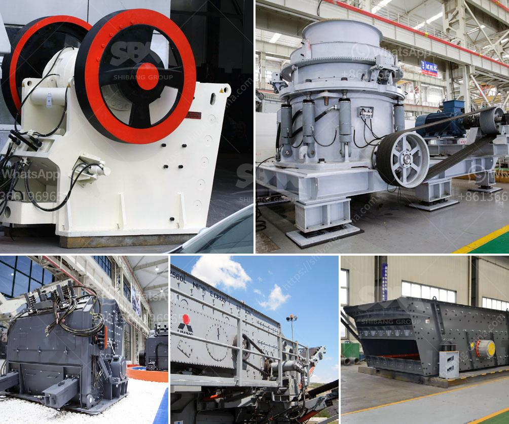

<h3>cement clinker grinding plant india</h3>
India is the second-largest producer of cement clinker in the world, accounting for approximately 10% of global production. The economic growth witnessed in the past few years has led to an increase in the demand for cement, making India a hub for cement manufacturing. As the industry continues to expand, cement clinker grinding plants have become an integral part of this growth story.

Clinker, the main raw material for cement production, is a solid substance produced in kilns after the heating of limestone, clay, and other materials. To obtain the desired quality of cement, clinker grinding is performed to refine the particle size and quality.

Cement clinker grinding plants are designed to address the ever-growing environmental concerns surrounding cement production. These plants employ state-of-the-art technology to minimize emissions and optimize energy consumption. Additionally, they promote the recycling of waste materials, further contributing to sustainable development.

One such successful initiative in India is the cement clinker grinding plant set up by Emami Cement Limited. The plant is located in Panagarh, West Bengal, and is a part of the company's plans to expand its presence in the eastern region of India. The grinding unit is strategically located near the Grand Trunk Road, facilitating easy access to major transportation routes.

The cement clinker grinding plant at Panagarh has a capacity of 2 million tons per annum and adheres to stringent quality standards. The plant is equipped with technologically advanced equipment and automation systems to ensure smooth operations and consistent product quality. This includes advanced control systems, high-efficiency separators, and energy-efficient grinding mills.

Emami Cement Limited's cement clinker grinding plant in Panagarh has also adopted several sustainable practices to minimize its environmental impact. The plant utilizes energy-efficient technologies, such as vertical roller mills, which consume significantly less energy compared to traditional ball mills. This results in reduced carbon emissions and lower energy costs.

Furthermore, the grinding plant actively promotes the usage of alternative fuels, such as biomass, within its production process. This helps in reducing the dependency on fossil fuels and curbing greenhouse gas emissions. The plant also engages in the responsible disposal of waste generated during the grinding process, ensuring minimal environmental harm.

Apart from the environmental benefits, the cement clinker grinding plant in Panagarh contributes to the local economy by generating employment opportunities. The project has provided direct and indirect employment to hundreds of individuals, benefitting both skilled and unskilled workers. In addition, the plant has contributed to the social development of the region by investing in community initiatives and welfare programs.

In conclusion, the cement clinker grinding plant in India is a significant step towards sustainable development in the cement industry. The use of advanced technologies and sustainable practices promotes environmental conservation and reduces carbon footprints. It also stimulates economic growth by creating employment opportunities and supporting local communities. As India strives to achieve the goals of a green and resilient future, cement clinker grinding plants play a crucial role in shaping the landscape of the cement industry.
<h3>Contact us</h3><ul><li><strong>Whatsapp:&nbsp;<a href="https://wa.me/8613661969651">+8613661969651</a></strong></li><li><a href="https://swt.shibang-china.com/?git&amp;zhl&amp;cement clinker grinding plant india"><strong>Online Service(chat now)</strong></a></li></ul><h3>Related</h3><ul><li><a href='price of industrial hammer mill.md'>price of industrial hammer mill</a></li><li><a href='calcium plant in india.md'>calcium plant in india</a></li><li><a href='quartz crushers price in india.md'>quartz crushers price in india</a></li><li><a href='used quarry equipment from usa.md'>used quarry equipment from usa</a></li><li><a href='roller raymond mill with best price.md'>roller raymond mill with best price</a></li></ul>