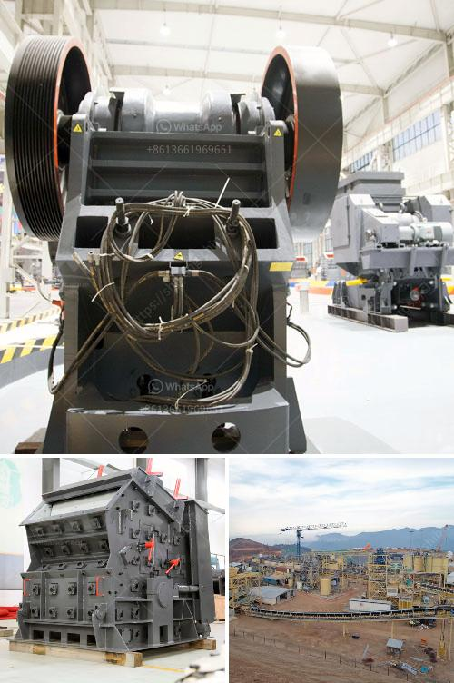

<h3>cement grinding ball mill process</h3>
Cement grinding ball mill process is divided into three stages: raw meal preparation, clinker grinding and cement grinding.

Raw meal preparation is the first step in the cement manufacturing process. Cement grinding ball mill process involves raw materials such as limestone, clay, iron ore and gypsum. It grinds these materials into a powder so they can be burned and mixed together in the correct proportions to form a good quality cement.

The raw materials are initially crushed by jaw crusher or hammer crusher to a size of about 25mm. Then they are sent into the ball mill for grinding. The grinding process reduces the size of the raw materials by mechanical force, which breaks up the large particles into smaller ones. The raw materials are ground into a fine powder, called raw meal.

Clinker is a nodular material produced during the cement manufacturing process. To produce cement, clinker is ground to a fine powder in a cement mill, along with a small amount of gypsum. This powder is the final product, cement.

The clinker is fed into the cement mill along with gypsum and other additives, such as fly ash, slag, or limestone. The grinding process of clinker and additives in the cement mill produces fine particles which are further classified by a separator into the desired fineness.

The grinding of cement clinker and additives into a fine powder is a crucial step in the cement manufacturing process. In this process, cement ball mill is usually used as the main grinding equipment. It is often paired with a classifier to produce a uniform and fine powder, which is then transported to the cement silo for storage.

The cement ball mill has a rotating cylinder filled with steel balls. As the mill rotates, the steel balls crush and grind the clinker and additives into a fine powder. The cement powder is then transported to the cement silo by a bucket elevator or a pneumatic conveyor system.

The ball mill process is energy-intensive and generates a large amount of heat. Therefore, cooling is necessary to prevent the equipment from over-heating. Cooling measures such as water spraying inside the mill and air cooling can be taken to maintain the temperature within the desired range.

In conclusion, the cement grinding ball mill process is an important process in the cement manufacturing process. It plays a vital role in improving the overall performance and efficiency of cement production. The ball mill is a highly energy-intensive process, which consumes more than 60% of the total electricity consumption in a cement plant. Therefore, it is important to ensure the optimal operation of the ball mill to minimize energy consumption and maximize the production capacity.
<h3>Contact us</h3><ul><li><strong>Whatsapp:&nbsp;<a href="https://wa.me/8613661969651">+8613661969651</a></strong></li><li><a href="https://swt.shibang-china.com/?git&amp;zhl&amp;cement grinding ball mill process"><strong>Online Service(chat now)</strong></a></li></ul><h3>Related</h3><ul><li><a href='how much is gold hammer mill crusher.md'>how much is gold hammer mill crusher</a></li><li><a href='nigeria cone crusher photos.md'>nigeria cone crusher photos</a></li><li><a href='quartz crusher plant cost.md'>quartz crusher plant cost</a></li><li><a href='crusher industrial jaw crusher information.md'>crusher industrial jaw crusher information</a></li><li><a href='nigeria rock crusher for sale.md'>nigeria rock crusher for sale</a></li></ul>