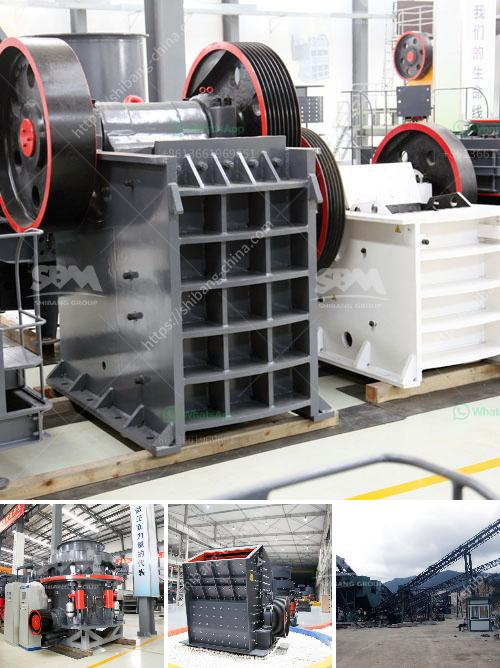

<h3>cement plant equipment china</h3>
China is a country known for its vast industrial development and manufacturing capabilities. One of the key sectors contributing to China's growth is the cement industry. To meet the growing demands of the construction industry, cement plants in China need efficient and reliable equipment.

Cement plant equipment in China includes various types of machinery such as crushers, mills, kilns, and packaging machinery, among others. These machines play a crucial role in the cement manufacturing process, ensuring that the production runs smoothly and meets the required quality standards.

One of the leading equipment manufacturers in China is Fote Machinery. Fote specializes in providing advanced cement plant equipment, catering to the diverse needs of cement producers. With years of experience and expertise in the industry, Fote has earned a reputation for delivering high-quality equipment that is efficient, durable, and cost-effective.

Fote's cement plant equipment in China is designed to optimize the production process and minimize energy consumption. Their crushers, for instance, are equipped with advanced technology to crush raw materials efficiently. Their mills are capable of grinding clinker and other materials into a fine powder, ensuring the desired particle size and chemical composition of the cement.

Furthermore, Fote's kilns are designed to provide consistent and controlled heating, essential for the chemical reactions that occur during the production of cement. They also offer packaging machinery that ensures the precise filling and sealing of cement bags, optimizing the packaging process.

In addition to Fote Machinery, there are several other equipment manufacturers in China that cater to the needs of the cement industry. These manufacturers continuously invest in research and development to improve the performance and efficiency of their equipment.

In conclusion, China's cement industry requires advanced and reliable equipment to meet the growing demands of the construction sector. Equipment manufacturers in China, such as Fote Machinery, offer a range of cement plant equipment that is efficient, durable, and cost-effective. With their advanced technology and expertise, these manufacturers play a crucial role in supporting China's cement production and overall industrial growth.
<h3>Contact us</h3><ul><li><strong>Whatsapp:&nbsp;<a href="https://wa.me/8613661969651">+8613661969651</a></strong></li><li><a href="https://swt.shibang-china.com/?git&amp;zhl&amp;cement plant equipment china"><strong>Online Service(chat now)</strong></a></li></ul><h3>Related</h3><ul><li><a href='jaw crushing plant.md'>jaw crushing plant</a></li><li><a href='fly ash powder making.md'>fly ash powder making</a></li><li><a href='stone crusher specification.md'>stone crusher specification</a></li><li><a href='rock crusher machine for sale.md'>rock crusher machine for sale</a></li><li><a href='cone crusher for sale in philippines.md'>cone crusher for sale in philippines</a></li></ul>