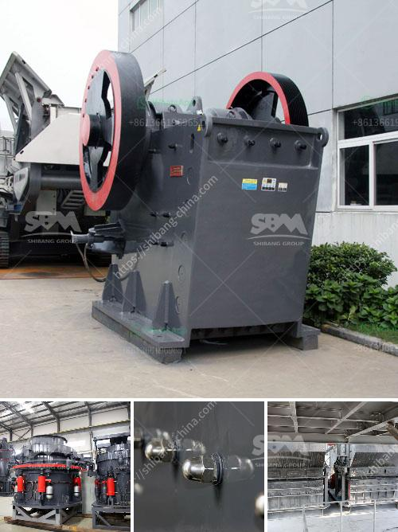

<h3>cement plant layout consultants in south africa</h3>
Cement plant layout consultants play a crucial role in the construction industry in South Africa. These professionals have extensive knowledge and expertise in designing efficient and cost-effective cement plants. With their guidance, cement companies can optimize their operations, enhance productivity, and minimize environmental impact.

The layout of a cement plant is a complex process that involves careful planning and design. It requires expertise in various areas such as engineering, architecture, and environmental management. Cement plant layout consultants possess the necessary expertise to consider all these aspects and create a well-planned and functional layout.

One of the key factors that cement plant layout consultants consider is the flow of materials within the plant. They analyze the movement of raw materials, such as limestone and clay, from the quarry to the crusher, and then to the preheater and kiln. The consultants evaluate the most efficient routes and distances to minimize transportation costs and ensure smooth operations.

Efficient flow of materials also includes a well-designed conveyor system. Cement plant layout consultants evaluate the conveyor belt system to ensure it is properly designed and configured to transport materials in a timely manner. This helps to reduce bottlenecks and delays in the production process.

Another important aspect that cement plant layout consultants consider is the placement of equipment and machinery. They analyze the space available and strategically position the equipment to maximize efficiency and productivity. This involves considering factors such as accessibility for maintenance and repair, optimal use of space, and safety requirements.

Cement plant layout consultants also pay close attention to environmental considerations. They ensure that the plant is designed in a manner that minimizes the impact on the environment. This includes implementing measures to reduce dust, noise, and emissions. They may recommend the installation of advanced filtration systems, noise barriers, and other technologies to mitigate environmental concerns.

Additionally, cement plant layout consultants take into account future expansion and growth. They design a layout that allows for scalability and flexibility. This enables the plant to accommodate increased production demands and incorporate new technologies or processes as the industry evolves.

The role of cement plant layout consultants extends beyond the initial design phase. They collaborate with various stakeholders, including engineers, architects, construction workers, and environmental regulators, throughout the project to ensure its successful implementation.

In conclusion, cement plant layout consultants in South Africa play a vital role in the construction industry. Their expertise and knowledge in designing efficient and eco-friendly cement plants contribute to the overall success of the industry. By optimizing the flow of materials, positioning equipment strategically, considering environmental considerations, and planning for future expansion, these consultants help cement companies achieve operational excellence and sustainable growth.
<h3>Contact us</h3><ul><li><strong>Whatsapp:&nbsp;<a href="https://wa.me/8613661969651">+8613661969651</a></strong></li><li><a href="https://swt.shibang-china.com/?git&amp;zhl&amp;cement plant layout consultants in south africa"><strong>Online Service(chat now)</strong></a></li></ul><h3>Related</h3><ul><li><a href='used crushers sale usa.md'>used crushers sale usa</a></li><li><a href='stone crusher machine philippines.md'>stone crusher machine philippines</a></li><li><a href='crawler mobile crushers.md'>crawler mobile crushers</a></li><li><a href='mobile crushers concrete aggregate.md'>mobile crushers concrete aggregate</a></li><li><a href='indopol roller grinding mills.md'>indopol roller grinding mills</a></li></ul>