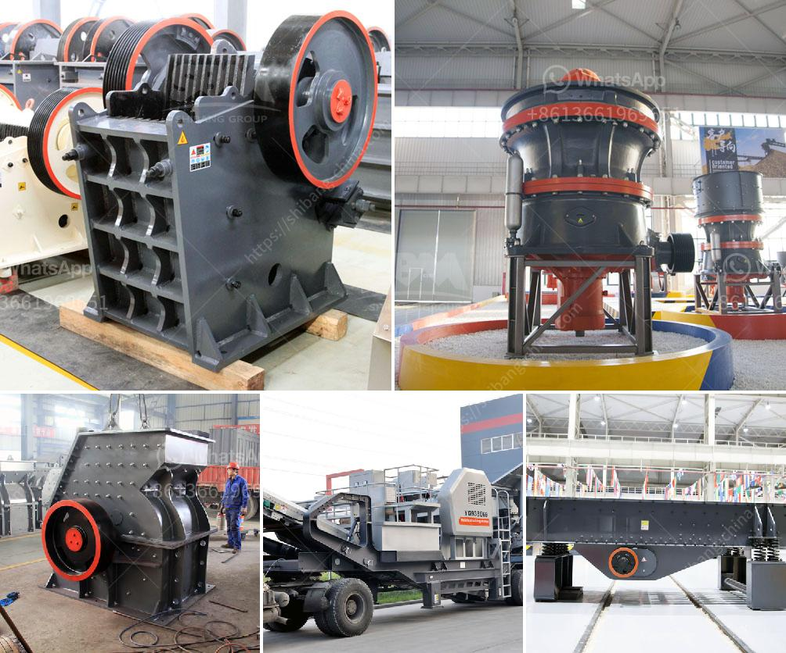

<h3>cement plant process in south africa</h3>
Cement production in South Africa started in 1892. This was a very significant moment for the country, as cement would help build the infrastructure needed for economic and social development. The cement plant process is divided into several steps.

First, raw materials such as limestone, clay, shale, iron ore, and sand are mined. These raw materials are crushed and blended in the correct proportions to produce the raw meal needed for the cement production process. The raw meal is then heated in a kiln at extremely high temperatures, around 1450 degrees Celsius.

During the heating process, chemical reactions take place, transforming the raw meal into clinker. The clinker is then combined with gypsum and other additives such as fly ash or slag, to produce the final cement product. This mixture is ground into a fine powder, which is packed into bags or transported in bulk to be used in construction projects.

South Africa, being a developing country, has a growing demand for cement due to the increasing infrastructure development and urbanization. The cement industry plays a crucial role in supporting economic growth and job creation in the country.

However, the cement plant process also has some negative impacts on the environment. The extraction of raw materials can result in habitat destruction and biodiversity loss. The huge amounts of energy required to heat the kilns contribute to greenhouse gas emissions, leading to climate change.

To mitigate these environmental impacts, cement plants implement various sustainability initiatives. This includes using alternative fuels such as biomass or waste materials, which reduces reliance on fossil fuels and results in lower carbon emissions. Water and energy conservation measures are also put in place to minimize resource consumption.

In conclusion, the cement plant process in South Africa plays a vital role in infrastructure development and economic growth. However, it is essential to continue improving sustainability practices to reduce the industry's environmental footprint and ensure a more sustainable future.
<h3>Contact us</h3><ul><li><strong>Whatsapp:&nbsp;<a href="https://wa.me/8613661969651">+8613661969651</a></strong></li><li><a href="https://swt.shibang-china.com/?git&amp;zhl&amp;cement plant process in south africa"><strong>Online Service(chat now)</strong></a></li></ul><h3>Related</h3><ul><li><a href='ball mill maintenance seminar.md'>ball mill maintenance seminar</a></li><li><a href='dolomite crushers for sale.md'>dolomite crushers for sale</a></li><li><a href='mining conveyor belt china.md'>mining conveyor belt china</a></li><li><a href='sewa rental stone crusher.md'>sewa rental stone crusher</a></li><li><a href='used construction machinery rates in pakistan.md'>used construction machinery rates in pakistan</a></li></ul>