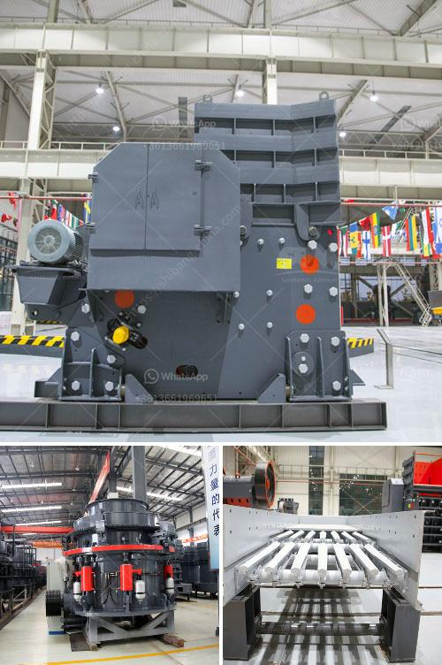

<h3>cement processing plant</h3>
A cement processing plant is a facility that transforms limestone, clay, sand, and iron ore into cement, a key ingredient in the construction industry. The raw materials used in the production of cement undergo a series of complex processes, including crushing, grinding, blending, and heating, to create the final product.

One of the primary components in cement production is limestone. Quarried limestone rocks are crushed into smaller pieces using crushers, which are then transported to the plant. At the plant, these rocks are further crushed and mixed with other materials such as clay and sand to create a homogenous mix.

The next step in the cement production process is grinding. The blended raw materials are ground into a fine powder using ball mills or roller mills. This grinding process helps achieve the desired particle size and facilitates the subsequent chemical reactions required for cement production.

After the grinding process, the powdered raw materials are blended in an appropriate ratio to ensure uniformity. This blending process ensures that the final cement product has consistent quality and properties, making it suitable for construction purposes.

The blended raw materials are then transferred to a kiln, a large rotating furnace. In the kiln, the raw materials are heated at high temperatures, typically between 1,400 and 1,500 degrees Celsius. This intense heat causes chemical reactions, known as calcination, which transforms the raw materials into clinker.

Clinker is a sintered material with lumps formed during the heating process. It primarily consists of calcium silicates, which are the main components of cement. The clinker is cooled and then ground into a fine powder, resulting in the final cement product.

After the clinker grinding process, the cement is stored in silos or packaged in bags for distribution. From here, it can be transported to construction sites, ready to be used in various applications such as building foundations, roads, bridges, and other infrastructure projects.

A cement processing plant requires significant investments in terms of machinery, equipment, and infrastructure. It also requires careful environmental management due to the emissions generated during the production process. Many modern cement plants have implemented advanced technologies and efficient processes to minimize their environmental impact and reduce energy consumption.

To summarize, a cement processing plant plays a vital role in the construction industry by transforming raw materials into cement, a crucial component for various construction projects. The complex processes involved in cement production require careful operations, blending, and heating to achieve the desired quality and properties of the final product. As the construction industry continues to grow, cement processing plants are expected to play a pivotal role in meeting the demand for sustainable building materials.
<h3>Contact us</h3><ul><li><strong>Whatsapp:&nbsp;<a href="https://wa.me/8613661969651">+8613661969651</a></strong></li><li><a href="https://swt.shibang-china.com/?git&amp;zhl&amp;cement processing plant"><strong>Online Service(chat now)</strong></a></li></ul><h3>Related</h3><ul><li><a href='difference between milling and grinding.md'>difference between milling and grinding</a></li><li><a href='sayaji stone crushers ahmedabad.md'>sayaji stone crushers ahmedabad</a></li><li><a href='jaw crusher manufacturer.md'>jaw crusher manufacturer</a></li><li><a href='concrete crusher for rent in toronto.md'>concrete crusher for rent in toronto</a></li><li><a href='quarry crusher mine stone.md'>quarry crusher mine stone</a></li></ul>