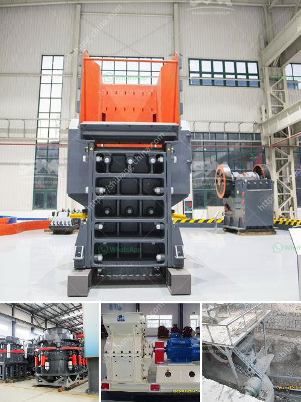

<h3>cement production process</h3>
Cement is a vital building material that is used in the construction industry for various applications. The production process of cement involves several stages that commence with the extraction of raw materials from the quarry and ends with the final product.

The first step in the cement production process is the extraction of limestone and clay from the quarry. The extracted materials are crushed into smaller pieces and then transported to the plant for further processing.

Once at the plant, the raw materials are carefully preheated and then sent into a rotating kiln. The intense heat in the kiln, usually around 1450°C, causes chemical reactions to occur, resulting in the formation of clinker – a grey, glass-like material.

After leaving the kiln, the clinker is cooled, and gypsum is added to regulate its setting time. The cooled clinker is then ground into a fine powder, known as cement. Additional materials, such as fly ash or slag, can also be added at this stage to enhance specific properties of the cement.

Following the grinding process, the cement is bagged or transported in bulk to be distributed to construction sites.

It is important to note that the cement production process is energy-intensive and can contribute to environmental pollution. Efforts are being made to develop sustainable practices in the industry, including the use of alternative fuels and raw materials, as well as energy-efficient technologies.

In conclusion, cement production is a complex process that involves the extraction of raw materials, their treatment, and the subsequent grinding and packaging of the final product. It is an essential component in the construction industry and requires careful management to minimize its environmental impact.
<h3>Contact us</h3><ul><li><strong>Whatsapp:&nbsp;<a href="https://wa.me/8613661969651">+8613661969651</a></strong></li><li><a href="https://swt.shibang-china.com/?git&amp;zhl&amp;cement production process"><strong>Online Service(chat now)</strong></a></li></ul><h3>Related</h3><ul><li><a href='gold mining mining gold mining cost.md'>gold mining mining gold mining cost</a></li><li><a href='limestone powder making process.md'>limestone powder making process</a></li><li><a href='mtw european type trapezium mill.md'>mtw european type trapezium mill</a></li><li><a href='cement clinker grinding plant cost.md'>cement clinker grinding plant cost</a></li><li><a href='vibrating screen supplier philippines.md'>vibrating screen supplier philippines</a></li></ul>