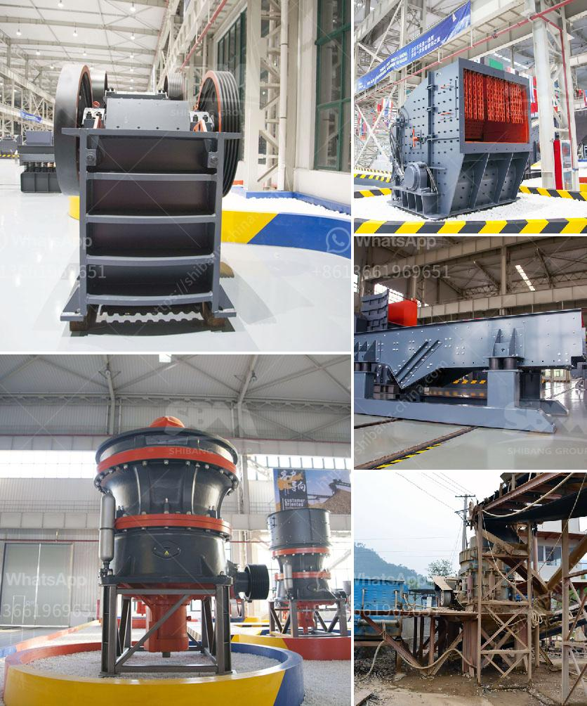

<h3>cement stone crusher for sale</h3>
Crusher machines have paved the way for enhanced construction technology. Today, cement is an essential material in house construction projects. If you are working on a construction project, you need a reliable cement stone crusher for sale to crush the largest stones in your industry.

But before diving into the purchase decision, we must understand the importance of a cement stone crusher. This article will guide you through the various features of a cement stone crusher and why it is an investment worth considering.

First and foremost, a cement stone crusher is designed to break larger rocks and stones into smaller pieces. This process is vital when you are planning to use cement for construction purposes. The crusher machine ensures that the cement is crushed uniformly, resulting in better quality cement that is suitable for construction.

One of the key features to consider in a cement stone crusher is its ability to produce a consistent grain size. The crushers are engineered to reduce the size of the largest stones and rocks to a specific, manageable size. This is crucial, as consistency in grain size allows for a uniform mixture when cement is being made.

Another significant aspect to consider is the efficiency and productivity of the crusher. Time is of the essence in any construction project, and having a crusher that can process large volumes of stones and rocks quickly is essential. Look for a cement stone crusher that has a high output capacity and a robust motor to ensure efficient crushing.

Durability is a crucial factor to check when purchasing a cement stone crusher. Construction projects can be rough, and you want a machine that can withstand the wear and tear of the job site. Look for crushers made with high-quality materials such as hardened steel, which can withstand the demands of crushing large stones for an extended period.

Additionally, consider the maintenance requirements of the cement stone crusher. Regular maintenance is necessary to keep the machine running smoothly and to prevent breakdowns that can halt construction progress. Look for a crusher that has easy access points for cleaning and maintenance, and make sure to adhere to the manufacturer’s guidelines for upkeep.

Now that we have covered the importance of a cement stone crusher, let us review some of the available options in the market. Many reputable companies offer a range of cement stone crushers, each with its unique features and capacities.

Consider your specific needs and budget when making a purchase decision. Look for a cement stone crusher that suits your requirement in terms of capacity, size, and power. Also, explore customer reviews to ensure that the crusher you are considering is reliable and performs as advertised.

In conclusion, a cement stone crusher is an essential investment for any construction project. The right crusher can ensure that the cement used in your construction maintains high quality standards, contributing to the overall success of your project. Take your time to research and compare different options available in the market before making a purchase. The right cement stone crusher will not only increase efficiency and productivity but also help you crush your dreams (literally and figuratively!).
<h3>Contact us</h3><ul><li><strong>Whatsapp:&nbsp;<a href="https://wa.me/8613661969651">+8613661969651</a></strong></li><li><a href="https://swt.shibang-china.com/?git&amp;zhl&amp;cement stone crusher for sale"><strong>Online Service(chat now)</strong></a></li></ul><h3>Related</h3><ul><li><a href='mtm raymond mill.md'>mtm raymond mill</a></li><li><a href='jual mesin raymond mill.md'>jual mesin raymond mill</a></li><li><a href='agen jaw crusher kenya.md'>agen jaw crusher kenya</a></li><li><a href='components of the hammer crusher.md'>components of the hammer crusher</a></li><li><a href='stone for stone mill.md'>stone for stone mill</a></li></ul>