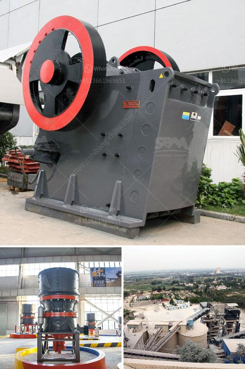

<h3>cement vertical roller mill</h3>
Cement vertical roller mill, also called cement mill or cement grinder, is a type of mill used to grind the hard, nodular clinker into fine powder in the cement manufacturing process. Vertical roller mill has been widely used in cement industry for its incomparable advantages, such as high efficiency, low power consumption, and large drying capacity. Compared with the traditional ball mill, cement vertical roller mill can save energy by 30% to 40%.

One of the most important aspects of the cement vertical roller mill is its relatively low maintenance requirements. Regular maintenance is essential for maintaining optimal performance and prolonging the lifespan of the equipment. However, compared to other types of cement mills, the vertical roller mill requires less maintenance due to its simple structure and fewer moving parts.

In addition, the cement vertical roller mill offers a wider range of materials for use in its grinding process, which allows for easier and more efficient grinding of various materials such as limestone, coal, and clinker. This flexibility makes the vertical roller mill ideal for clinker grinding as it allows for the easy and efficient grinding of additional materials such as slag, fly ash, and other additives.

Furthermore, the cement vertical roller mill is environmentally friendly and sustainable. It has a smaller carbon footprint compared to traditional cement mills due to its more energy-efficient grinding process. Additionally, the cement vertical roller mill operates with low noise and produces less dust, making it a safer and cleaner option for cement production.

Overall, the cement vertical roller mill is a great addition to the cement production line, as it provides a cost-effective and efficient grinding solution that can significantly improve the quality of cement. With its compact design and high availability, the cement vertical roller mill has become the preferred choice for cement manufacturers.
<h3>Contact us</h3><ul><li><strong>Whatsapp:&nbsp;<a href="https://wa.me/8613661969651">+8613661969651</a></strong></li><li><a href="https://swt.shibang-china.com/?git&amp;zhl&amp;cement vertical roller mill"><strong>Online Service(chat now)</strong></a></li></ul><h3>Related</h3><ul><li><a href='used stone crushing plant for sale in spain.md'>used stone crushing plant for sale in spain</a></li><li><a href='stone crushing equipment south africa.md'>stone crushing equipment south africa</a></li><li><a href='fastest gold hammer mill in china.md'>fastest gold hammer mill in china</a></li><li><a href='advantages and disadvantages of a roll crusher.md'>advantages and disadvantages of a roll crusher</a></li><li><a href='large capacity jaw crusher stone crusher quarry machine.md'>large capacity jaw crusher stone crusher quarry machine</a></li></ul>