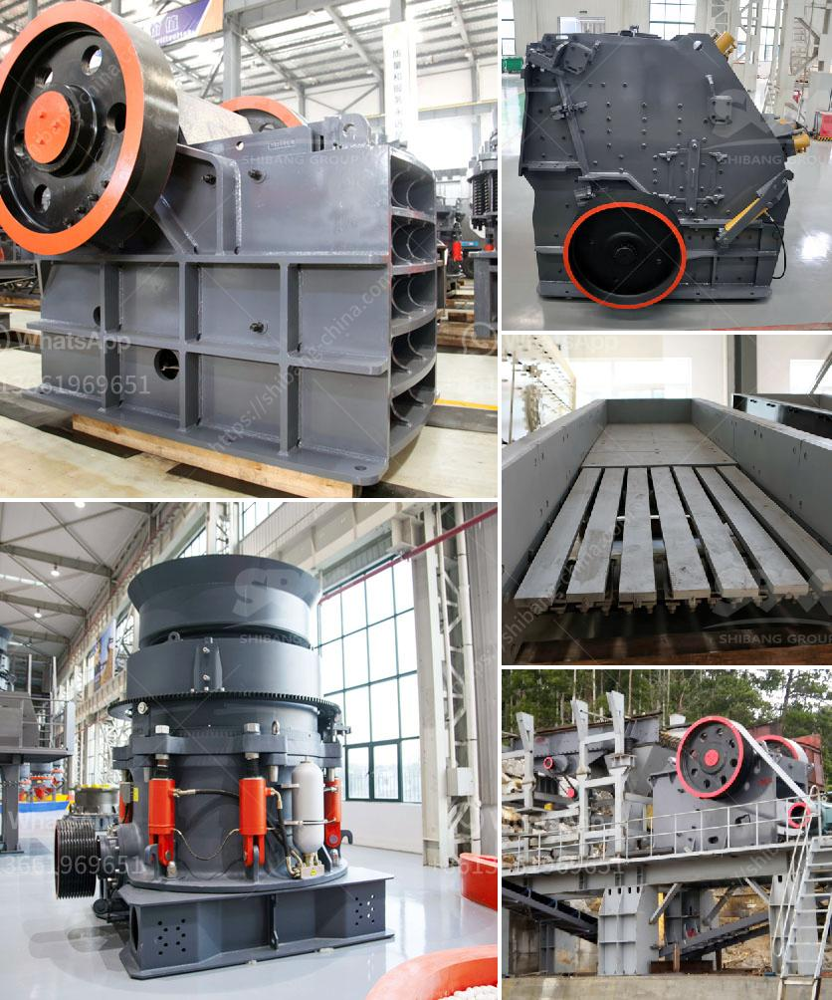

<h3>ceramic crusher machine</h3>
In the world of recycling, nothing goes to waste. Every material has the potential to be reused, saving resources, reducing waste, and benefiting the environment. When it comes to ceramics, a crucial component in many industries, finding an effective way to repurpose ceramic waste is a top priority. This is where the ceramic crusher machine comes into play.

Ceramic waste is a byproduct of various manufacturing processes, such as pottery, tile production, and even the semiconductor industry. Traditionally, this waste has been disposed of in landfills, taking up valuable space, or being incinerated, contributing to air pollution. However, with the advancement of technology, ceramic waste can now be turned into a valuable resource.

The ceramic crusher machine is designed to reduce large ceramic material into smaller particles suitable for further processing. These machines are made up of a sturdy frame that supports crushing plates, hammers, or jaws, which exert force on the material to break it down into smaller pieces. Depending on the desired size, the ceramic waste can be further crushed, milled, or ground.

One of the primary uses of the ceramic crusher machine is in the recycling industry. Ceramic waste, once crushed, can be repurposed as a raw material in the production of new ceramic products. This not only conserves natural resources but also reduces the amount of waste being sent to landfills. Many industries, including construction, pottery, and sculpture-making, can benefit from using recycled ceramics as a cost-effective alternative.

Another significant use of the ceramic crusher machine is in the processing of ceramic waste for disposal. By crushing the waste into smaller pieces, the volume is reduced, making it easier and more economical to transport and dispose of. This is particularly useful in industries that generate large quantities of ceramic waste, such as the tile or semiconductor industry.

Furthermore, the ceramic crusher machine can be used to crush defective or rejected ceramic products. Instead of discarding these products, they can be crushed and reintroduced into the production process. This not only saves on raw materials but also reduces the overall cost of production. It is a win-win situation for both manufacturers and the environment.

The ceramic crusher machine offers several advantages over traditional methods of ceramic waste disposal. Firstly, it is a cost-effective solution. Instead of paying for expensive landfill space or incineration services, manufacturers can invest in efficient ceramic crushing machines. Secondly, it is an environmentally friendly solution. By recycling ceramic waste, valuable resources are conserved, and pollution is reduced. Lastly, it is a versatile solution. The ceramic crusher machine can be customized to meet specific requirements, making it suitable for various industries.

In conclusion, the ceramic crusher machine is a game-changer in the recycling industry. By crushing ceramic waste and repurposing it as a valuable resource, the machine not only reduces waste but also saves resources and benefits the environment. With its cost-effectiveness, eco-friendliness, and versatility, the ceramic crusher machine is a must-have for any industry dealing with ceramic waste.
<h3>Contact us</h3><ul><li><strong>Whatsapp:&nbsp;<a href="https://wa.me/8613661969651">+8613661969651</a></strong></li><li><a href="https://swt.shibang-china.com/?git&amp;zhl&amp;ceramic crusher machine"><strong>Online Service(chat now)</strong></a></li></ul><h3>Related</h3><ul><li><a href='contribution of quarrying in nigeria economy.md'>contribution of quarrying in nigeria economy</a></li><li><a href='philippine gold processing refining.md'>philippine gold processing refining</a></li><li><a href='coal wash plants for sale in malaysia.md'>coal wash plants for sale in malaysia</a></li><li><a href='chrome crusher machine price list.md'>chrome crusher machine price list</a></li><li><a href='granite crusher processing machines south africa.md'>granite crusher processing machines south africa</a></li></ul>