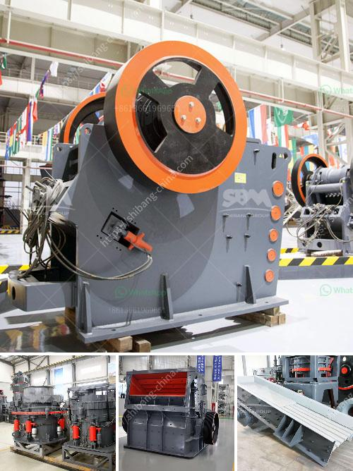

<h3>ceramic mortar powder grinding mill in nigeria</h3>
Ceramic mortar powder grinding mill is a type of grinding equipment used to grind materials into extremely fine powder. This type of grinding mill is commonly used in various applications in industries such as ceramics, metallurgy, chemical engineering, and mining. In Nigeria, ceramic mortar powder grinding mill is mainly used on mining sites to grind different types of minerals such as quartz, feldspar, clay, talc, barite, fluorite, clay, kaolin, gypsum, and graphite, etc.

Nigeria is rich in mineral resources with large deposits of various types of minerals. These minerals are highly valuable and are essential raw materials for many industries. However, before these minerals can be used in different applications, they need to be processed, and grinding is an important step in this process.

Ceramic mortar powder grinding mill in Nigeria is ideal for grinding and pulverizing minerals and other materials. The mill is suitable for both dry and wet grinding processes. In the dry grinding process, materials are ground by impact and friction forces. The grinding media inside the mill crushes and grinds the materials into fine powder. In the wet grinding process, materials are mixed with water or other liquids to form a slurry. The grinding media and the slurry are then involved in the grinding process, resulting in the reduction of the particle size.

The ceramic mortar powder grinding mill in Nigeria is designed with advanced technology to ensure high efficiency and productivity. It is equipped with a high-speed rotating grinding disc that creates a centrifugal force to throw the materials against the grinding ring. This force increases the grinding capacity and efficiency, allowing for finer and more consistent particle size distribution.

Furthermore, the grinding mill is equipped with a classifier that separates the fine powder from the coarse particles. The fine powder is collected in the collection system, while the coarse particles are returned to the grinding chamber for further grinding. This ensures that the final product meets the required particle size specifications and ensures a high-quality end product.

Moreover, the grinding mill is designed with safety features to prevent accidents and protect the operator from any potential harm. It is equipped with a safety interlock system that prevents the mill from starting unless all the safety guards are properly in place. Additionally, the mill is equipped with noise and dust control systems to minimize the impact on the environment and ensure a safe working environment.

In conclusion, the ceramic mortar powder grinding mill in Nigeria is a valuable tool for processing minerals and other materials. It offers efficient and high-quality grinding performance, allowing for the production of finely ground powders. With its advanced technology and safety features, this grinding mill is widely used in various industries in Nigeria.
<h3>Contact us</h3><ul><li><strong>Whatsapp:&nbsp;<a href="https://wa.me/8613661969651">+8613661969651</a></strong></li><li><a href="https://swt.shibang-china.com/?git&amp;zhl&amp;ceramic mortar powder grinding mill in nigeria"><strong>Online Service(chat now)</strong></a></li></ul><h3>Related</h3><ul><li><a href='ballast crushing equipment.md'>ballast crushing equipment</a></li><li><a href='limestone grinding machine manufacturers in india.md'>limestone grinding machine manufacturers in india</a></li><li><a href='ball mill brochure eccentric outer cone crusher.md'>ball mill brochure eccentric outer cone crusher</a></li><li><a href='mobile crusher line.md'>mobile crusher line</a></li><li><a href='manufacturer of coal processing equipment.md'>manufacturer of coal processing equipment</a></li></ul>