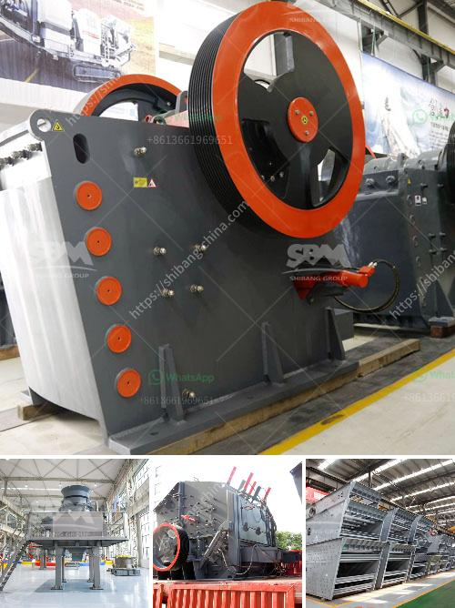

<h3>charcoal coal making process</h3>
Charcoal coal holds a significant place in various industries, serving as a valuable source of energy and fuel. The process of making charcoal coal involves transforming wood or other carbon-rich materials into a high-carbon substance through a controlled burning process known as pyrolysis. This method has been used for centuries and remains an essential practice today.

The first step in making charcoal coal involves selecting the appropriate raw materials. Wood from various trees, such as birch, oak, or maple, is commonly used due to its high carbon content. The wood is then carefully cut into small pieces and dried to reduce its moisture content. This ensures an efficient and clean burning process.

Once the wood is dried, it is stacked in a controlled environment such as a kiln or charcoal pit. The wood is then covered with a layer of soil or sand to minimize air flow and prevent combustion. This creates an oxygen-limited environment, which is crucial for the pyrolysis process to occur effectively.

The next step is to ignite the stacked wood carefully. The initial purpose of lighting the wood is to remove the moisture content and initiate the release of gases. These gases are then captured and used as valuable byproducts in various industries, such as the production of chemicals or fuel.

Throughout the pyrolysis process, the wood is heated to a high temperature, but kept below the point of complete combustion. As a result, the wood undergoes a chemical transformation, leaving behind charcoal coal as the final product. This transformation occurs due to the release of volatile compounds from the wood, leaving a carbon-rich residue.

The final step in the charcoal coal making process involves cooling and collecting the produced charcoal. After the wood has undergone pyrolysis, it is left to cool down gradually, usually for several days or weeks. This gradual cooling process helps prevent the charcoal from re-igniting or burning.

Once cooled, the charcoal is carefully excavated from the kiln or pit and sorted for different applications based on its size and quality. The resulting charcoal coal can be used as fuel for cooking, heating, or as a raw material in industrial processes.

In conclusion, the ancient process of making charcoal coal has stood the test of time and remains an integral part of many industries. Through controlled burning and pyrolysis, wood is transformed into a valuable source of energy and fuel. As technology advances, this traditional method continues to play a vital role in meeting the demands of various sectors worldwide.
<h3>Contact us</h3><ul><li><strong>Whatsapp:&nbsp;<a href="https://wa.me/8613661969651">+8613661969651</a></strong></li><li><a href="https://swt.shibang-china.com/?git&amp;zhl&amp;charcoal coal making process"><strong>Online Service(chat now)</strong></a></li></ul><h3>Related</h3><ul><li><a href='crushing plant in the philippines.md'>crushing plant in the philippines</a></li><li><a href='recycled crushed concrete 20mm.md'>recycled crushed concrete 20mm</a></li><li><a href='jaw crusher vibration analysis pdf.md'>jaw crusher vibration analysis pdf</a></li><li><a href='lime and dolomite crusher plant.md'>lime and dolomite crusher plant</a></li><li><a href='granite crushing plant for sale in south africa.md'>granite crushing plant for sale in south africa</a></li></ul>