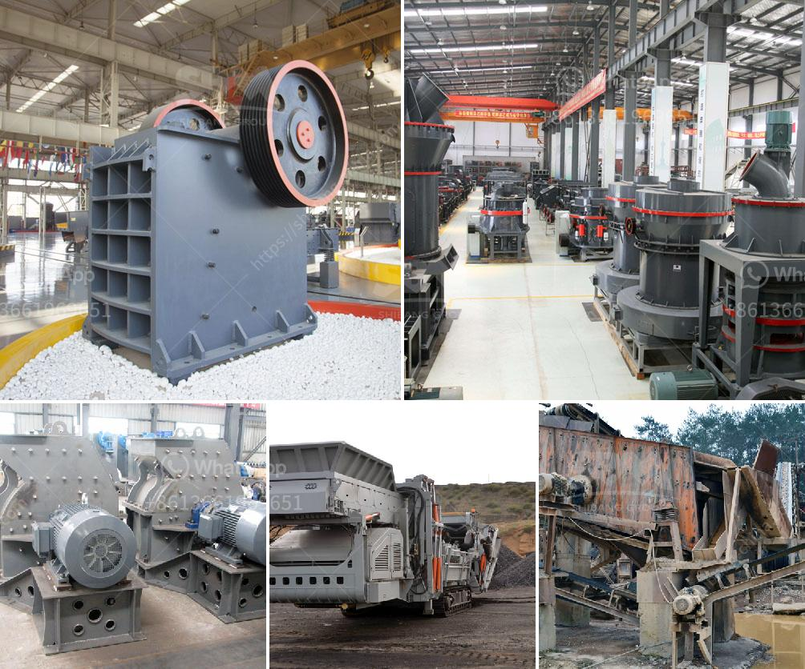

<h3>china clay processing plant</h3>
China clay, also known as kaolin, is a white, soft, plastic clay mainly composed of kaolinite minerals. It is widely used in various industries such as paper, ceramics, paint, rubber, and plastics. In recent years, China has emerged as the largest producer and exporter of china clay, accounting for over 25% of the global production.

China clay mining is a labor-intensive process requiring the expertise of geologists, engineers, and skilled laborers. The process starts with the exploration and identification of potential clay deposits through geological surveys and aerial mapping. Once a suitable site is identified, the land is cleared, and overburden soil and vegetation are removed to expose the clay deposit.

The mining of china clay involves both open-pit and underground mining methods. Open-pit mining is the most common and involves the extraction of the kaolin deposit by removing the overlying soil and rock layers. This is done using heavy machinery such as bulldozers, backhoes, and excavators. The extracted clay is then transported to the processing plant for further treatment.

At the processing plant, the china clay undergoes several stages of processing to remove impurities and enhance its properties. The first step is known as beneficiation, which involves the separation of the clay from the non-clay minerals present in the raw ore. This is typically done using froth flotation, a process in which air bubbles are introduced into a slurry of clay and water. The froth containing the clay particles is then skimmed off and dried.

Once the clay is separated, it is further processed to achieve the desired particle size, brightness, and whiteness. This involves processes such as crushing, grinding, and sizing. The clay is then subjected to bleaching and purification treatments, using chemicals such as sodium hydrosulfite and hydrogen peroxide, to remove any remaining impurities and improve its color and brightness.

After the purification process, the clay is dried and classified into different grades based on its particle size. It is then packed and shipped to various industries for use in a wide range of applications. For instance, in the paper industry, china clay is used as a filler in paper production to improve printability and brightness. In the ceramics industry, it is used as a raw material for making porcelain, tiles, and sanitaryware.

The china clay processing plant employs advanced technologies and state-of-the-art equipment to ensure efficient and sustainable production. Environmental conservation is given utmost priority, with measures such as waste water treatment and reclamation of land after mining activities.

China's dominance in the global china clay market can be attributed to its vast reserves, favorable mining conditions, and technological advancements in extraction and processing. The country's growing infrastructure and construction activities have also contributed to the increased demand for china clay.

In conclusion, china clay processing plants play a crucial role in the manufacturing sector by providing high-quality clay for various industries. The complex process of mining and processing china clay requires skilled professionals and advanced equipment. China's position as the largest producer and exporter of china clay reflects its commitment to meeting global demand and ensuring sustainable mining practices.
<h3>Contact us</h3><ul><li><strong>Whatsapp:&nbsp;<a href="https://wa.me/8613661969651">+8613661969651</a></strong></li><li><a href="https://swt.shibang-china.com/?git&amp;zhl&amp;china clay processing plant"><strong>Online Service(chat now)</strong></a></li></ul><h3>Related</h3><ul><li><a href='jaw crusher machine in saudi.md'>jaw crusher machine in saudi</a></li><li><a href='difference between milling and grinding.md'>difference between milling and grinding</a></li><li><a href='from lead ore saparated gold and silver plant.md'>from lead ore saparated gold and silver plant</a></li><li><a href='stone crusher for road construction.md'>stone crusher for road construction</a></li><li><a href='rock crusher screen.md'>rock crusher screen</a></li></ul>