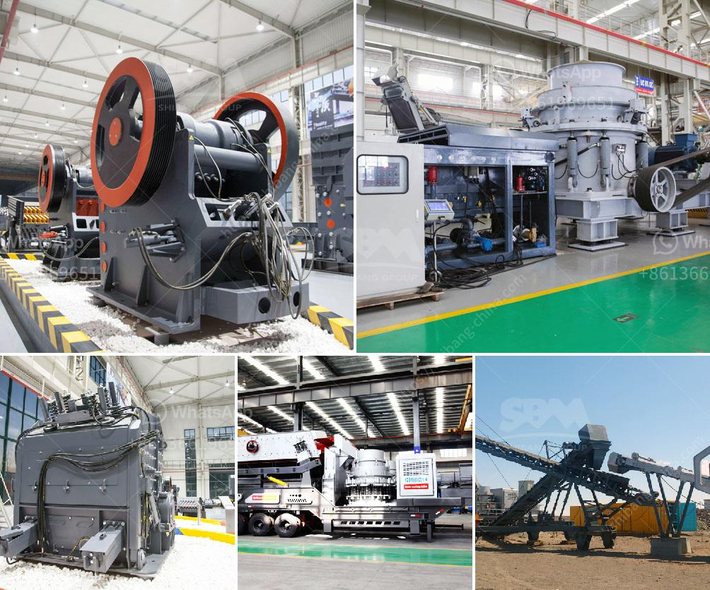

<h3>china coal crusher high capacity</h3>
China is a large producer and consumer of coal. As the largest source of energy for power generation, coal plays a crucial role in China's energy mix. With the rapid development of the economy and the increasing demand for energy, it becomes imperative to improve coal utilization efficiency and reduce environmental impacts.

One important aspect of coal utilization is crushing. Coal crushers are widely used in China's coal mining, coal washing plants, power generation, and cement plants. In the process of coal crushing, the coal crusher capacity plays a crucial role.

Coal crushing plant heads to a large-scale size reduction process that can handle raw materials with a maximum size of up to 1,500mm. If a higher capacity is required, a feeder and a conveyor are used to transfer the raw materials between the crushing and screening stages.

China coal crushers are designed with a high crushing ratio. This means that the coal particles are crushed into smaller sizes, which increase the surface area for better combustion efficiency. Additionally, high capacity coal crushers lower the ash content in the coal and thus improve the quality of the final product.

The high capacity of China coal crushers can be attributed to the advanced technology used in their design. State-of-the-art materials and components are used to ensure durability and efficient performance. Moreover, China's coal crushers are equipped with advanced hydraulic systems, allowing for easy and fast adjustments of the crusher settings.

With a high capacity coal crusher, China can effectively and efficiently process large amounts of coal, enabling the country to meet its energy demands. This not only helps China reduce its reliance on imported coal but also contributes to the sustainable development of the domestic coal industry.

In conclusion, China coal crusher high capacity plays a significant role in meeting China's energy needs and optimizing coal utilization. With continuous advancements in technology and design, China's coal crushers are becoming more efficient, reliable, and environmentally friendly. By embracing such innovations, China sets a leading example in the global coal industry, promoting sustainable energy development for a better future.
<h3>Contact us</h3><ul><li><strong>Whatsapp:&nbsp;<a href="https://wa.me/8613661969651">+8613661969651</a></strong></li><li><a href="https://swt.shibang-china.com/?git&amp;zhl&amp;china coal crusher high capacity"><strong>Online Service(chat now)</strong></a></li></ul><h3>Related</h3><ul><li><a href='puzzolana crusher plant nairobi kenya.md'>puzzolana crusher plant nairobi kenya</a></li><li><a href='rock crusher and screens philippines.md'>rock crusher and screens philippines</a></li><li><a href='manufacturer jaw crusher.md'>manufacturer jaw crusher</a></li><li><a href='used stone cutting machine from japan.md'>used stone cutting machine from japan</a></li><li><a href='rock salt mining open pit feasibility study.md'>rock salt mining open pit feasibility study</a></li></ul>