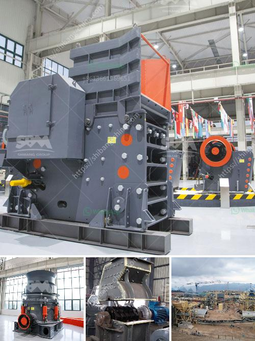

<h3>china dahua series jaw crusher</h3>
When it comes to quarry and mining industries, there is no doubt that jaw crushers are the primary choice for crushing and processing hard and abrasive materials. However, choosing the right jaw crusher can be challenging, especially with the vast number of jaw crushers available in the market. Among the various options, the China Dahua series jaw crusher stands out for its exceptional features and performance.

The China Dahua series jaw crushers are single toggle jaw crushers characterized by a high throughput rate, simple design, low weight, and customization options. As a result, these crushers are robust and reliable, providing high productivity in challenging conditions.

One of the key features of the Dahua series jaw crusher is its excellent crushing capacity. With a wide range of models ranging from 30 tons to 150 tons per hour, these crushers can meet the requirements of any quarrying or mining operation. The advanced crushing chamber design and optimized nip angle ensure efficient crushing and reduced wear on the jaw plates, resulting in a longer lifespan and lower operational costs.

Moreover, the China Dahua series jaw crushers are equipped with a hydraulic system that provides quick and easy adjustments of the crusher settings. This feature allows the user to adapt the crusher to different feed materials and optimize the production process. Furthermore, the hydraulic system also protects the crusher from potential damage caused by uncrushable materials, ensuring a safe and reliable operation.

In terms of maintenance and serviceability, the Dahua series jaw crushers excel in providing easy access to all crucial components. The modular design and high-quality construction materials simplify maintenance tasks, enabling quick inspections, replacements, and repairs. Additionally, the availability of genuine spare parts and excellent after-sales service from Dahua ensures maximum uptime and minimized downtime.

Another advantage of choosing Dahua series jaw crushers is the wide range of customization options available. From the selection of the crusher size to the choice of optional features, such as the integrated motor base or the hydraulic toggle system, customers can tailor their jaw crushers to meet their specific needs and preferences.

Furthermore, Dahua is known for its commitment to innovation and continuous improvement. With its team of experienced engineers and state-of-the-art manufacturing facilities, Dahua ensures that its jaw crushers incorporate the latest technological advancements. This dedication to innovation guarantees that customers get the most advanced and reliable equipment, giving them a competitive edge in their operations.

In conclusion, the China Dahua series jaw crusher is a must-have equipment for quarrying and mining industries. Its exceptional crushing capacity, reliable performance, and easy maintenance make it an ideal choice for crushing hard and abrasive materials. Moreover, the wide range of customization options and the commitment to innovation from Dahua ensure that customers can get the most suitable and advanced jaw crusher for their specific needs. With Dahua's jaw crushers, quarry and mining operators can achieve high productivity, reduced operational costs, and optimized production processes.
<h3>Contact us</h3><ul><li><strong>Whatsapp:&nbsp;<a href="https://wa.me/8613661969651">+8613661969651</a></strong></li><li><a href="https://swt.shibang-china.com/?git&amp;zhl&amp;china dahua series jaw crusher"><strong>Online Service(chat now)</strong></a></li></ul><h3>Related</h3><ul><li><a href='pulverizer for carbon black.md'>pulverizer for carbon black</a></li><li><a href='crusher machine from south korea.md'>crusher machine from south korea</a></li><li><a href='impact crusher for sale in turkey.md'>impact crusher for sale in turkey</a></li><li><a href='sand washing machine price.md'>sand washing machine price</a></li><li><a href='ball mill for sale south africa.md'>ball mill for sale south africa</a></li></ul>