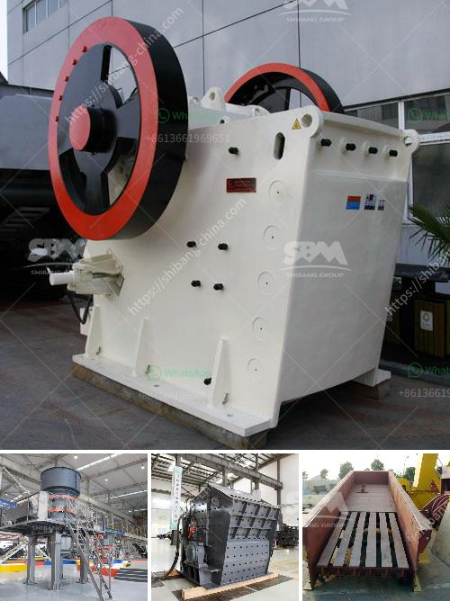

<h3>china gold water grinding mills</h3>
China has long been known for its rich history and cultural heritage. Amongst the many treasures it possesses, one particular item that has garnered attention throughout the ages is the gold water grinding mill.

The gold water grinding mill, also known as the Jinshui Mo, is a traditional Chinese grinding tool. This ancient device has been used for centuries to grind, pulverize, and process various materials into fine powders. Its unique design and mechanism have made it a valuable tool in various industries, including traditional Chinese medicine, pottery, and art.

The gold water grinding mill is typically made of a stone or ceramic bowl-shaped container with a flat bottom and a small handle used for grinding. The container is filled with water, and the materials to be ground are added gradually. The grinding process begins by pressing and rubbing the material against the inner surface of the container using a smooth stone or pestle. The continuous circular motion gradually breaks down the materials, transforming them into a fine powder or paste.

One of the significant applications of gold water grinding mills is in traditional Chinese medicine. The precise grinding process helps release the active ingredients from medicinal herbs, allowing for better absorption and efficacy. By using the gold water grinding mill, herbalists can create various remedies to treat ailments and restore balance to the body. This ancient practice has been passed down from generation to generation and is still widely used in modern Chinese medicine today.

Gold water grinding mills are also crucial in the production of traditional Chinese pottery and ceramics. The grinding process allows ceramicists to refine the raw materials, remove impurities, and create a fine, smooth clay paste. This paste is then shaped into pottery pieces, such as vases, bowls, and plates, before being fired in a kiln. The use of gold water grinding mills ensures the creation of high-quality ceramics, with a desirable texture and finish.

In addition to medicine and pottery, gold water grinding mills play a vital role in traditional Chinese art and calligraphy. Artists use finely ground pigments made from minerals and natural dyes, such as cinnabar and malachite, to create vibrant colors in their paintings and calligraphy. The grinding process allows for the perfect consistency and purity of the pigments, enabling artists to achieve exquisite details and shading in their work. The gold water grinding mill has become an indispensable tool for painters and calligraphers seeking to express their creativity.

The gold water grinding mill is not only a functional tool but also a symbol of Chinese cultural heritage. Its craftsmanship and unique mechanism reflect the ingenuity and wisdom of ancient Chinese artisans. Despite modern advancements, the gold water grinding mill continues to be cherished and used by many who appreciate its historical significance and practical applications.

In conclusion, the gold water grinding mill is an integral part of China's rich heritage. Its unique design and grinding mechanism have made it a valuable tool in traditional Chinese medicine, pottery, and art. The meticulous grinding process it offers ensures the creation of fine powders, pastes, and pigments that are essential in various industries. As China continues to embrace modernization, the preservation and appreciation of the gold water grinding mill serve as a testament to the country's enduring cultural legacy.
<h3>Contact us</h3><ul><li><strong>Whatsapp:&nbsp;<a href="https://wa.me/8613661969651">+8613661969651</a></strong></li><li><a href="https://swt.shibang-china.com/?git&amp;zhl&amp;china gold water grinding mills"><strong>Online Service(chat now)</strong></a></li></ul><h3>Related</h3><ul><li><a href='manufacturer of clinker grinding machine.md'>manufacturer of clinker grinding machine</a></li><li><a href='catalog of vertical grinding mill pdf.md'>catalog of vertical grinding mill pdf</a></li><li><a href='stone crusher supplier.md'>stone crusher supplier</a></li><li><a href='coal screening plant.md'>coal screening plant</a></li><li><a href='vibrating screen indonesia.md'>vibrating screen indonesia</a></li></ul>