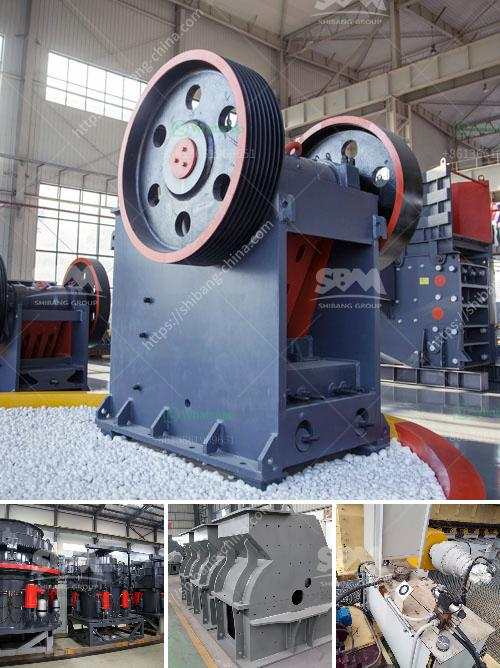

<h3>china grove roller mill</h3>
Nestled in the small town of China Grove, North Carolina, lies a historic gem - the China Grove Roller Mill. This remarkable piece of history, which dates back to the early 1900s, serves not only as a museum but also as a cultural icon that showcases the region's agricultural heritage.

The China Grove Roller Mill, also known as the China Grove Milling Company, initially started as a gristmill, grinding grains such as wheat and corn into flour. As the needs of the community evolved, so did the mill. In 1903, it underwent significant renovations and was equipped with the latest technology of that era - roller mills. This upgrade revolutionized the milling industry by improving the efficiency and quality of the ground grains.

Today, visitors can step back in time as they explore the mill's carefully preserved artifacts and machinery. The interior offers a glimpse into the past, with original pulleys, belts, and gears still in place. The China Grove Roller Mill, with its towering grain bins and rustic red brick exterior, stands as a testament to the industriousness and ingenuity of the early residents of China Grove.

The mill played a crucial role in sustaining the local community. Farmers from the surrounding areas would haul their harvested crops to the mill, where they would be ground into flour. The China Grove Roller Mill provided an essential service that enabled farmers to utilize their crops efficiently, ensuring their livelihoods and the prosperity of the region.

Aside from its practical significance, the mill served as a hub for social interaction. It witnessed countless friendships, business deals, and gatherings within its walls. The mill became a place where stories were shared, laughter echoed, and the vibrant spirit of the community thrived. Such a rich history brings a warm sense of nostalgia to those who visit, as they sense the tangible connection to the past.

Recognizing the mill's historical and cultural value, the town of China Grove embarked on a mission to preserve this iconic landmark for future generations. In 1983, the mill was listed on the National Register of Historic Places, ensuring its protection and recognition. Various fundraising efforts and grants helped finance the restoration projects that followed, allowing the mill to stand proudly as a symbol of China Grove's heritage.

Today, the China Grove Roller Mill serves as both a museum and a venue for community events. Guided tours offer visitors an in-depth understanding of the mill's operation and its significance to the region. The mill's expansive grounds provide a beautiful backdrop for concerts, festivals, and antique car shows, fostering a sense of camaraderie and unity among the community.

China Grove Roller Mill stands as a reminder of the community's roots in agriculture and industry. Its preservation ensures that future generations will have the opportunity to appreciate and learn from this integral part of the town's history. The mill's enduring legacy serves as an inspiration for the residents of China Grove to honor their heritage and preserve the traditions that make their town unique.

As visitors step inside the China Grove Roller Mill, they are transported to a time when hard work, innovation, and community were at the heart of everyday life. It is a place where the past comes alive, whispering stories of a bygone era and reminding us of the importance of preserving our history for generations to come.
<h3>Contact us</h3><ul><li><strong>Whatsapp:&nbsp;<a href="https://wa.me/8613661969651">+8613661969651</a></strong></li><li><a href="https://swt.shibang-china.com/?git&amp;zhl&amp;china grove roller mill"><strong>Online Service(chat now)</strong></a></li></ul><h3>Related</h3><ul><li><a href='iron crushing plant in mexico.md'>iron crushing plant in mexico</a></li><li><a href='list of crusher in bharatpur distric.md'>list of crusher in bharatpur distric</a></li><li><a href='ball mill mexico.md'>ball mill mexico</a></li><li><a href='used pulverizer ball mill india.md'>used pulverizer ball mill india</a></li><li><a href='ball mill grinding relation with quality pdf.md'>ball mill grinding relation with quality pdf</a></li></ul>