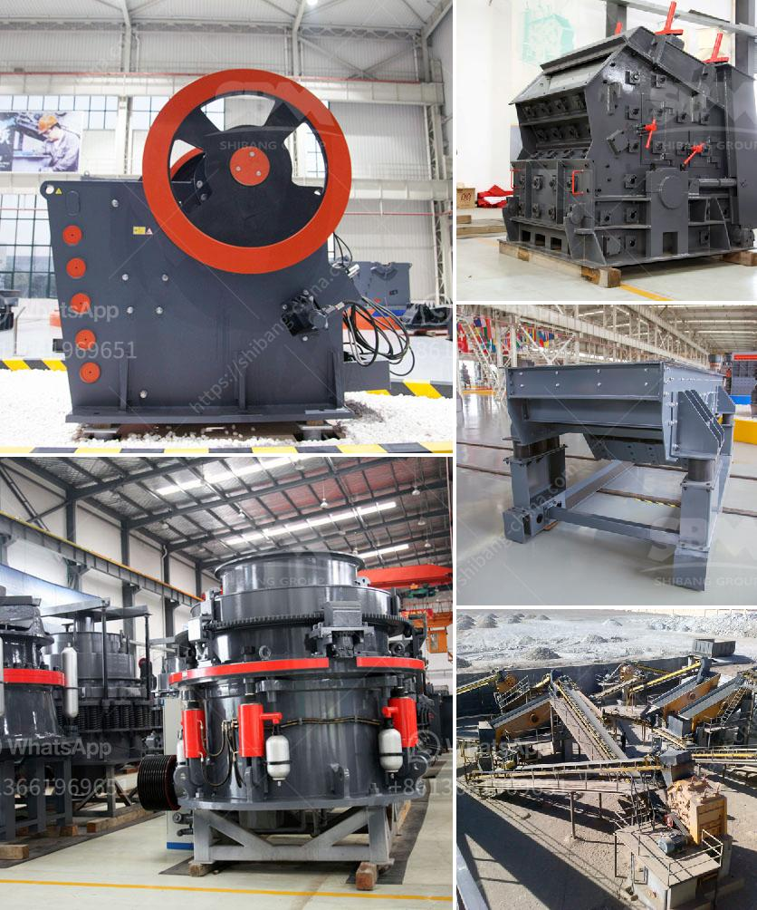

<h3>china quarry crusher equipment</h3>
China is a country rich in mineral resources, providing ample opportunities for the development of various industries. As the world's largest producer of crushing and screening equipment, China plays a key role in the development of the quarry crusher industry.

The quarry crusher equipment industry is gaining traction in China and is expected to grow at a rapid pace during the forecast period. A quarry crusher is used to crush ores and rocks into smaller particles, reducing their size for further processing and use in various industries. It plays a crucial role in improving productivity and efficiency in mining operations.

One of the primary factors driving the growth of the quarry crusher equipment industry in China is the increasing demand for aggregates in the construction industry. China's urbanization and infrastructure development initiatives have led to a surge in demand for sand, gravel, and crushed stones. Quarry crushers help in meeting this demand by crushing large rocks into smaller sizes, making them suitable for use in construction projects such as roads, bridges, and buildings.

China's commitment to sustainable development and environmental conservation has also played a significant role in the growth of the quarry crusher equipment industry. Environmental regulations and concerns have prompted mining companies to adopt technologies that minimize dust emissions and noise pollution. Quarry crushers equipped with advanced technologies effectively control dust and noise levels, making them environmentally friendly and socially responsible options.

In addition to the growing demand for aggregates and the need for eco-friendly solutions, the rapid urbanization of China's rural areas is fueling the market for quarry crusher equipment. As more rural areas transform into urban centers, there is a growing need for infrastructure development. This, in turn, drives the demand for quarry crushers to extract and process the necessary raw materials efficiently.

China's emphasis on research and development has paved the way for technological advancements in the quarry crusher equipment industry. Mining companies in China are investing in innovative technologies, such as automation, robotics, and artificial intelligence, to enhance productivity and operational efficiency. These technologies improve the safety of workers and optimize the extraction and crushing processes, thereby reducing costs and increasing output.

As the government continues to invest heavily in infrastructure projects, the demand for quarry crusher equipment is expected to surge further. The Belt and Road Initiative, China's ambitious development strategy, aims to connect Asia, Europe, and Africa through a network of roads, railways, ports, and other infrastructure projects. This initiative will create numerous opportunities for quarry crusher equipment manufacturers and suppliers, driving the growth of the industry.

China's quarry crusher equipment industry is poised for significant growth in the coming years. With increasing demand for aggregates, strict environmental regulations, urbanization, and technological advancements, the industry offers tremendous opportunities for both domestic and international players. However, companies operating in this market must keep up with evolving customer demands and regulatory requirements to maintain their competitive edge.

In conclusion, China's quarry crusher equipment industry is experiencing rapid growth driven by factors such as increasing demand for aggregates, environmental concerns, urbanization, and technological advancements. The industry is set to thrive in the coming years, providing ample opportunities for both domestic and international players. It is an exciting time for the quarry crusher equipment industry in China, with immense potential for innovation, growth, and contribution to the country's development.
<h3>Contact us</h3><ul><li><strong>Whatsapp:&nbsp;<a href="https://wa.me/8613661969651">+8613661969651</a></strong></li><li><a href="https://swt.shibang-china.com/?git&amp;zhl&amp;china quarry crusher equipment"><strong>Online Service(chat now)</strong></a></li></ul><h3>Related</h3><ul><li><a href='quotation for minimum quary plant.md'>quotation for minimum quary plant</a></li><li><a href='processing of platinum ore flow sheet.md'>processing of platinum ore flow sheet</a></li><li><a href='crawler mobile crushers.md'>crawler mobile crushers</a></li><li><a href='sand crusher plant.md'>sand crusher plant</a></li><li><a href='how much do rock crushers cost.md'>how much do rock crushers cost</a></li></ul>