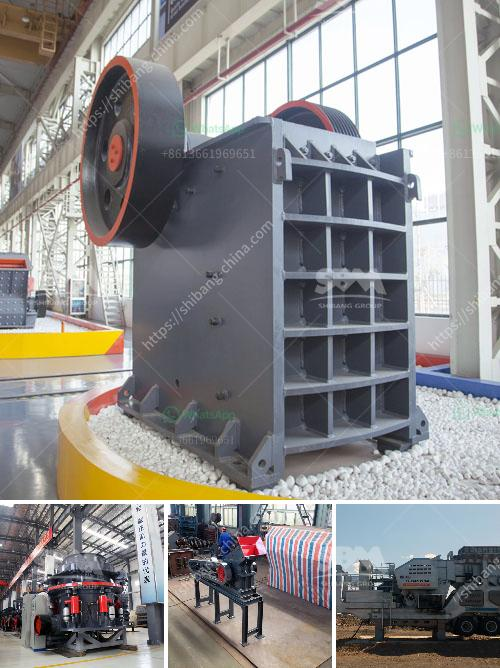

<h3>chinese aggregate crusher suppliers</h3>
China is the largest producer and consumer of aggregates throughout the world. With massive urbanization efforts underway in its cities, the country is witnessing an increased demand for construction materials such as sand, gravel, and crushed stone. To meet this growing need, there are numerous Chinese aggregate crusher suppliers. Here, we take a closer look at some of the leading manufacturers.

One of the top players in the Chinese market is Joyal. With over 30 years of experience in the industry, Joyal specializes in producing various types of crushers, including jaw crushers, cone crushers, and impact crushers. Their crushers are known for their high performance, reliability, and efficiency.

Another prominent supplier is Shanghai Shibang Machinery (SBM). The company offers a comprehensive range of crushers, including jaw crushers, cone crushers, and impact crushers. SBM crushers are known for their robust construction, user-friendly features, and superior performance.

Zhengzhou Yifan Machinery Co., Ltd. is another leading Chinese manufacturer. Their crushers are widely used in mining, construction, and other industries. Yifan crushers are known for their rugged design, high productivity, and low maintenance.

In addition to these manufacturers, there are also several smaller companies that supply aggregate crushers in China. These include SHANMAN (Shandong) Machinery Co., Ltd., ZHONGBO Heavy Machinery Co., Ltd., and others.

When selecting an aggregate crusher supplier, it is important to consider factors such as product quality, after-sales service, and reputation. Chinese manufacturers are known for their commitment to quality and customer satisfaction. Additionally, they offer competitive prices, making them a popular choice for both Chinese and international buyers.

In conclusion, the Chinese market for aggregate crushers is thriving due to the rapid urbanization and infrastructure development in the country. With a wide range of suppliers offering high-quality crushers, customers have numerous options to choose from. Whether it's jaw crushers, cone crushers, or impact crushers, Chinese manufacturers are well-positioned to meet the growing demand for construction aggregates in China and abroad.
<h3>Contact us</h3><ul><li><strong>Whatsapp:&nbsp;<a href="https://wa.me/8613661969651">+8613661969651</a></strong></li><li><a href="https://swt.shibang-china.com/?git&amp;zhl&amp;chinese aggregate crusher suppliers"><strong>Online Service(chat now)</strong></a></li></ul><h3>Related</h3><ul><li><a href='ball mill india.md'>ball mill india</a></li><li><a href='sayaji stone crushers ahmedabad.md'>sayaji stone crushers ahmedabad</a></li><li><a href='stone crusher specification.md'>stone crusher specification</a></li><li><a href='barite crushing machine.md'>barite crushing machine</a></li><li><a href='stone crusher plants.md'>stone crusher plants</a></li></ul>