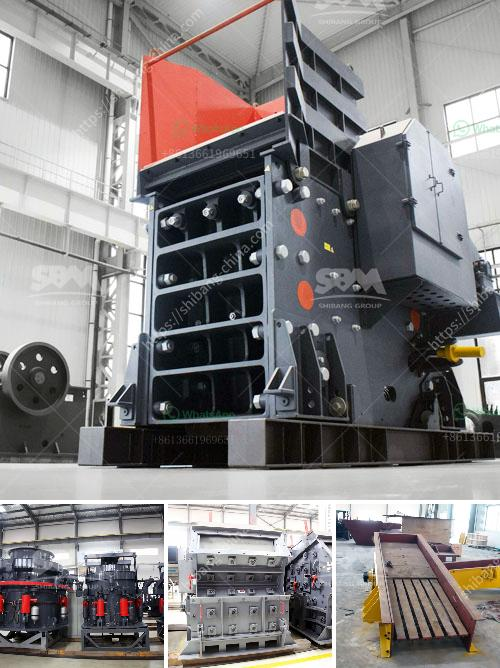

<h3>chrome crusher machine price list</h3>
Chrome crusher machine is a specialized machine used for crushing hard materials in the mining industry. It is designed to extract chrome ore from mineral deposits. The Chrome Crusher Machine is available in various sizes and types, including cone crushers, jaw crushers and vertical shaft impactors.

The price of chrome crushing equipment is mainly determined by the nature of the equipment, type of chrome ore, the configuration of the chrome crushing plant, the chrome crusher machine price list can vary.

As one of the professional chrome rock crusher manufacturers in China, we provide all kinds of chrome mining equipment for sale. In recent years, our chrome ore beneficiation plant have been sold to 100+ countries and regions around the world, such as South Africa, Zimbabwe, Zambia, Algeria, Australia, Canada, USA, Chile, Russia and The Middle East,etc.

We have earned a reputation for producing high quality, reliable machines for chrome ore processing. Our clients range from large multinational companies to small scale miners. All our customers are provided with comprehensive service and technical support for the chrome ore crusher machines.

Our chrome crusher machines are exported to India, South Africa,Pakistan ,Eygpt,Tajikistan. We are also a reputable supplier of industrial grinding equipment and crushing plant.

It is widely used in mining, smelting, road, building material and chemical industry. And many other industries. Professional manufacture gravity separator alluvial chrome mining machine production line jaw crusher plant.

There are many different types of chrome mining machines involved in the process. Chrome ore grinding plant is used to grind chrome ore into smaller size even powder.

Under the pressure of grinding part, the chrome ore may be . In the chrome ore mining plant, chrome ore grinding mill is used to grind chrome ore into smaller size even powder.

Traditional Chrome Ore grinding machine are ball mill, Raymond mill, vertical roller mill, super thin grinding mill and so on.

In chrome ore crushing equipment, we have jaw crusher, cone crusher, impact crusher and mobile crusher for chrome ore fine crushing.

There are three types of cone crushers, they are spring cone crusher, CS series cone crusher and hydraulic cone crusher.+

Among them, the chrome ore crushing machine is used to crush the large-sized chrome ore into smaller particles..
<h3>Contact us</h3><ul><li><strong>Whatsapp:&nbsp;<a href="https://wa.me/8613661969651">+8613661969651</a></strong></li><li><a href="https://swt.shibang-china.com/?git&amp;zhl&amp;chrome crusher machine price list"><strong>Online Service(chat now)</strong></a></li></ul><h3>Related</h3><ul><li><a href='stone crusher price list 300 tonnes capacity per hour.md'>stone crusher price list 300 tonnes capacity per hour</a></li><li><a href='stone crusher machine crusher.md'>stone crusher machine crusher</a></li><li><a href='jaw crusher vibration analysis pdf.md'>jaw crusher vibration analysis pdf</a></li><li><a href='rock crusher unit.md'>rock crusher unit</a></li><li><a href='metal crusher for rent.md'>metal crusher for rent</a></li></ul>