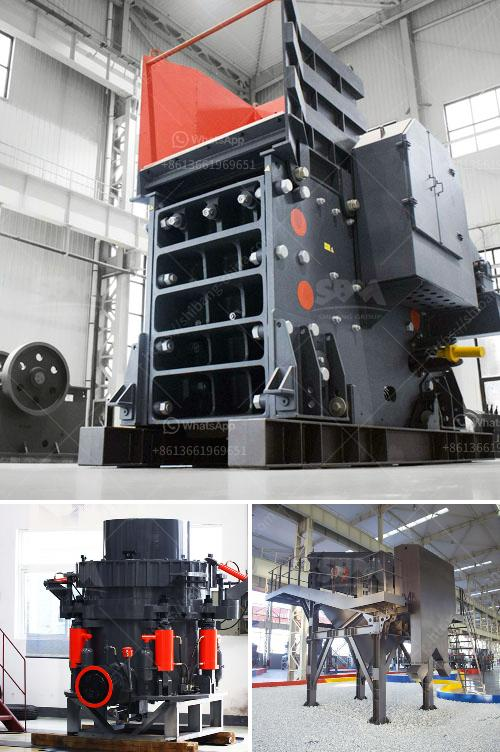

<h3>chrome mining methods in zimbabwe</h3>
Chrome mining in Zimbabwe is primarily achieved through the use of underground mining methods. In recent years, however, some producers have started making use of surface mining techniques. Many of these old mines have since been abandoned or placed under care and maintenance.

Underground mining, also known as deep-level mining, involves the extraction of minerals from underground deposits through a network of shafts and tunnels. This method is commonly employed in Zimbabwe's chrome mining operations due to its ability to access narrow seams that are difficult to reach using surface mining methods.

The underground mining process usually begins with the sinking of a vertical shaft and the excavation of horizontal levels, known as levels. These levels allow miners to access the chrome deposits. Once accessed, the ore is then blasted and extracted using various mining methods such as room and pillar mining, shrinkage stoping, and cut and fill mining.

Room and pillar mining involves creating pillars of ore to support the mine roof while allowing the ore to be extracted. In shrinkage stoping, drilling and blasting are used to create horizontal stopes, from which the ore is then manually extracted. Cut and fill mining, on the other hand, involves excavating a horizontal slice of ore and backfilling the void left behind with waste material.

Surface mining, on the other hand, involves the removal of overlying soil and rock to access the chrome deposits. This method is typically used for shallow ore bodies that are located near the surface. The most common surface mining techniques used in Zimbabwe include open-pit mining and strip mining.

Open-pit mining involves the excavation of a large open pit or surface excavation to extract the ore. Strip mining, on the other hand, involves the removal of a thin layer of overlying material, known as overburden, to uncover the ore. This method is usually employed when the ore is close to the surface.

In conclusion, chrome mining in Zimbabwe primarily utilizes underground mining methods due to the narrow seams being targeted. However, in recent years, some producers have also begun utilizing surface mining techniques for shallow ore bodies. These mining methods play a critical role in extracting Zimbabwe's valuable chrome deposits and contributing to the country's economy.
<h3>Contact us</h3><ul><li><strong>Whatsapp:&nbsp;<a href="https://wa.me/8613661969651">+8613661969651</a></strong></li><li><a href="https://swt.shibang-china.com/?git&amp;zhl&amp;chrome mining methods in zimbabwe"><strong>Online Service(chat now)</strong></a></li></ul><h3>Related</h3><ul><li><a href='how to calculate coal mill capacity for cement plant.md'>how to calculate coal mill capacity for cement plant</a></li><li><a href='enquiry about stone crusher.md'>enquiry about stone crusher</a></li><li><a href='mining companies that sell heavy equipment.md'>mining companies that sell heavy equipment</a></li><li><a href='rencana anggaran biaya stone crusher.md'>rencana anggaran biaya stone crusher</a></li><li><a href='crushing rock aggregate machinery.md'>crushing rock aggregate machinery</a></li></ul>