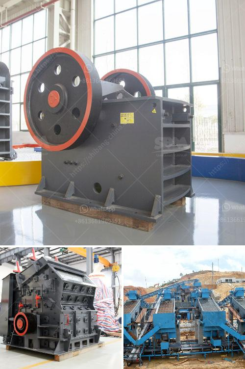

<h3>chrome washing plant for sale</h3>
The mining industry plays a crucial role in economic development, providing essential raw materials for various industries. One of the prominent minerals extracted is chrome, which is widely used in stainless steel production, automotive, and aerospace sectors. As demand for chrome continues to rise, an investment opportunity arises with chrome washing plants for sale.

Chrome washing plants help extract valuable chromite from overburdened ore deposits. These plants utilize various methods, such as spiral concentrators, shaking tables, and jigs, to wash and separate chromite particles from other minerals. The end result is a higher-grade chromite ore ready for processing.

Investing in a chrome washing plant offers several advantages. Firstly, it allows investors to tap into the growing demand for chrome, particularly in emerging markets. As industrialization and infrastructure development projects increase, the need for chrome in construction and manufacturing will soar, ensuring a significant return on investment.

Secondly, chrome washing plants for sale provide an opportunity to achieve environmental sustainability. Since these plants recycle water during the washing process, they ensure minimal water usage and reduce the environmental impact associated with traditional mining methods. Investors can take pride in supporting eco-friendly practices while reaping financial benefits.

Furthermore, chrome washing plants allow for efficient and cost-effective production. By using advanced technologies, these plants optimize the chromite extraction process, reducing the time, energy, and labor required. This translates into increased productivity and streamlined operations, leading to enhanced profitability.

Investors interested in chrome washing plants for sale should carefully consider various factors. The location of the plant is crucial, ensuring proximity to abundant chromite ore deposits and transportation routes. Additionally, assessing the plant's production capacity, equipment quality, and maintenance requirements are essential to ensure long-term profitability.

In conclusion, chrome washing plants for sale present a lucrative investment opportunity for astute investors. The rising demand for chrome and the need for eco-friendly mining practices make chrome washing plants a sound choice. Investing in these plants unlocks potential returns and contributes to sustainable economic growth. With careful analysis and consideration of crucial factors, investors can harness the potential of this thriving industry and secure long-term success.
<h3>Contact us</h3><ul><li><strong>Whatsapp:&nbsp;<a href="https://wa.me/8613661969651">+8613661969651</a></strong></li><li><a href="https://swt.shibang-china.com/?git&amp;zhl&amp;chrome washing plant for sale"><strong>Online Service(chat now)</strong></a></li></ul><h3>Related</h3><ul><li><a href='ball mills for sale.md'>ball mills for sale</a></li><li><a href='quartz plus wet grinder.md'>quartz plus wet grinder</a></li><li><a href='linear vibrating screen specifications.md'>linear vibrating screen specifications</a></li><li><a href='stone crusher manufacturers in india.md'>stone crusher manufacturers in india</a></li><li><a href='brushes for conveyor belts.md'>brushes for conveyor belts</a></li></ul>