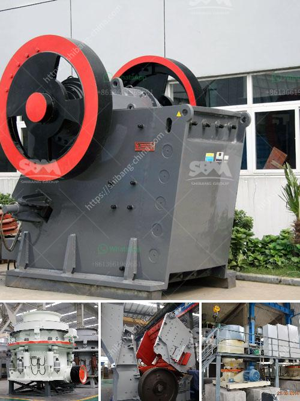

<h3>chromite ore flowsheet pdf</h3>
Chromite ore is a valuable mineral that is mainly used for the production of chromium metal, ferrochrome, and stainless steel. The ore is often found in deposits in countries such as South Africa, Kazakhstan, India, and Turkey. To extract the chromite, the ore is first finely ground and then separated through various physical and chemical processes.

The chromite ore flowsheet is the set of steps or processes used to separate chromite ore from impurities. The typical flowsheet involves numerous physical and chemical processes such as grinding, flotation, gravity separation, and magnetic separation. The specific processes vary depending on the characteristics of the ore and the desired final product.

The flowsheet begins with crushing and grinding the chromite ore to a fine size. This step is essential to increase the surface area of the ore particles, allowing for better liberation of the chromite from the gangue minerals. Liberation is the process of breaking the chromite ore from the surrounding rock, making it accessible for separation.

Once the chromite ore is finely ground, it is subjected to a flotation process. Flotation is a separation technique that relies on the differences in the surface properties of various minerals. In the case of chromite ore, specific chemicals, known as collectors, are added to the flotation cells to selectively bind with the chromite particles. This allows for the chromite to be separated from other minerals and float to the surface as a concentrate.

Gravity separation is another important step in the chromite ore flowsheet. This process involves the use of gravity forces to separate particles based on their density. The chromite ore is fed into a spiral concentrator, which utilizes the gravitational force to separate the heavy chromite particles from the lighter gangue minerals. The concentrate is then collected and further processed.

Magnetic separation is often used as a final step in the chromite ore flowsheet. This process uses magnetic properties to separate the chromite from other minerals. The ore is passed through a magnetic separator that attracts and retains the chromite particles while allowing the non-magnetic gangue minerals to pass through. This results in a chromite concentrate that can be further refined for the production of chromium metal or other products.

In conclusion, the chromite ore flowsheet is a complex series of processes used to extract chromite ore from its surrounding rock and separate it from impurities. The flowsheet involves crushing, grinding, flotation, gravity separation, and magnetic separation steps, all of which are necessary to produce a chromite concentrate suitable for further processing. Understanding the details of the chromite ore flowsheet is essential for efficient and cost-effective chromite mining and processing operations.
<h3>Contact us</h3><ul><li><strong>Whatsapp:&nbsp;<a href="https://wa.me/8613661969651">+8613661969651</a></strong></li><li><a href="https://swt.shibang-china.com/?git&amp;zhl&amp;chromite ore flowsheet pdf"><strong>Online Service(chat now)</strong></a></li></ul><h3>Related</h3><ul><li><a href='stone crushing plant project report.md'>stone crushing plant project report</a></li><li><a href='grinding machine for bentonite.md'>grinding machine for bentonite</a></li><li><a href='materials for zenith jaw crusher in europe.md'>materials for zenith jaw crusher in europe</a></li><li><a href='stone crushing plants of japanese technology.md'>stone crushing plants of japanese technology</a></li><li><a href='marble grinding machine bosch make.md'>marble grinding machine bosch make</a></li></ul>