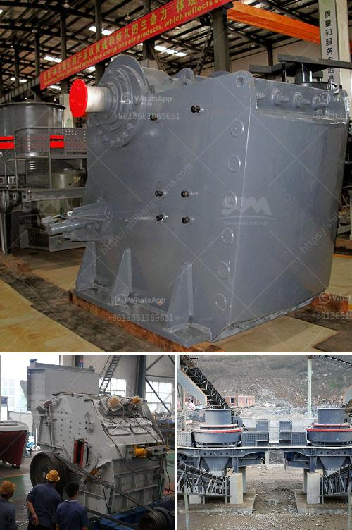

<h3>chromite ore processing in zimbabwe</h3>
Chromite is a mineral that is widely utilized in various industrial processes due to its high chromium content. In Zimbabwe, chromite is mined from the ultramafic rocks in the Great Dyke, a large layered igneous complex which is one of the most significant ore bodies in the world. The country has an estimated 12% of global chromite reserves and produces approximately 11% of the world's chromite ore.

The processing of chromite ore in Zimbabwe predominantly involves four stages: crushing, grinding, sizing, and concentration. The crushed ore is first comminuted in a jaw crusher, followed by secondary and tertiary cone crushers. The crushed ore is then further reduced to smaller sizes using grinding mills.

The next step is sizing, where the crushed and ground ore is classified into different sizes using screens or cyclones. This process helps separate the chromite grains from the gangue minerals, allowing for a more efficient concentration process. The sized ore is then subjected to concentration using gravity separation techniques such as spirals or shaking tables. This separates the heavy chromite grains from the lighter gangue minerals based on their specific gravity.

The final stage involves drying and packaging the concentrated chromite ore for shipping to various smelters around the world. The chromite ore typically undergoes smelting to produce ferrochrome, an alloy of chromium and iron which is used in the production of stainless steel.

The processing of chromite ore in Zimbabwe plays a vital role in the country's economy. The mining and processing operations provide employment opportunities for many people, contributing to poverty alleviation and economic growth. Additionally, the export of chromite ore generates foreign exchange earnings for the country, which helps to improve its overall balance of trade.

Overall, chromite ore processing in Zimbabwe has significant economic and industrial importance. The country's abundant reserves and efficient processing methods make it a valuable player in the global chromite market. However, sustained investment in technology and infrastructure is needed to further enhance the efficiency and competitiveness of the industry, ensuring the long-term sustainability of Zimbabwe's chromite mining and processing sector.
<h3>Contact us</h3><ul><li><strong>Whatsapp:&nbsp;<a href="https://wa.me/8613661969651">+8613661969651</a></strong></li><li><a href="https://swt.shibang-china.com/?git&amp;zhl&amp;chromite ore processing in zimbabwe"><strong>Online Service(chat now)</strong></a></li></ul><h3>Related</h3><ul><li><a href='best portable jaw crusher granite.md'>best portable jaw crusher granite</a></li><li><a href='diameter of the ball mill.md'>diameter of the ball mill</a></li><li><a href='impact crushers manufacturers.md'>impact crushers manufacturers</a></li><li><a href='jaw crusher discount.md'>jaw crusher discount</a></li><li><a href='kaolin mining india.md'>kaolin mining india</a></li></ul>