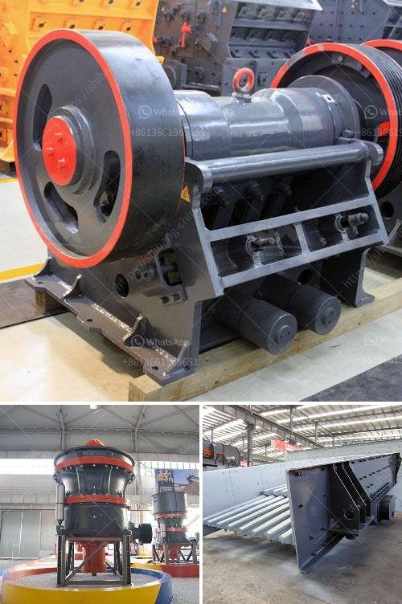

<h3>clay crusher machine for refractories</h3>
In the field of refractory applications, the quality of raw materials has a significant impact on the overall performance and durability of the end product. Refractories are materials that can withstand extremely high temperatures without losing their shape or strength. They are used in various industries such as steel, cement, and glass, where high temperatures are involved in the production process.

One crucial step in the manufacturing of refractories is the crushing of raw materials like clay. Clay is a naturally occurring material that is widely used in refractories due to its excellent thermal and chemical resistance properties. However, clay in its natural form is not readily usable for refractory applications. It needs to be processed and crushed into specific particle sizes to enhance its suitability for the intended use.

This is where the clay crusher machine comes into play. This machine is an essential piece of equipment in the refractory industry, as it reduces the size of clay through a series of rollers. The clay crusher machine consists of two parallel cylindrical rollers, each with a separate drive mechanism, enabling the rollers to rotate in opposite directions. The material to be crushed enters the gap between the rollers and is compressed, causing it to break into smaller pieces.

One of the key advantages of the clay crusher machine is its ability to process wet and sticky materials. Traditional crushing methods struggle with wet and sticky clay, leading to uneven particle sizes and reduced product quality. The clay crusher machine overcomes this challenge by using rollers that can handle a wide range of material moisture levels, ensuring consistent and uniform particle sizes.

The clay crusher machine also has a unique design, combining multiple features that enhance its performance and ease of use. The machine is equipped with a heavy-duty frame and bearings to withstand the high crushing forces generated during the operation. Additionally, the rollers are made of wear-resistant materials to prolong their lifespan and reduce maintenance requirements. The machine's compact size allows for easy installation in existing production lines without significant modifications.

The benefits of using a clay crusher machine go beyond improved particle size distribution. By crushing the clay into smaller pieces, the machine increases the surface area of the material, facilitating faster drying and firing processes. This results in improved energy efficiency and reduced production costs. Moreover, the reduced clay particle size enhances the plasticity of the material, making it easier to shape and mold into refractory products.

In conclusion, the clay crusher machine is a valuable tool for refractory applications. It offers a solution to the challenges faced in processing wet and sticky clay, ensuring consistent particle sizes and improved product performance. With its unique design and multiple benefits, the clay crusher machine revolutionizes the manufacturing of refractories by enhancing efficiency, durability, and cost-effectiveness.
<h3>Contact us</h3><ul><li><strong>Whatsapp:&nbsp;<a href="https://wa.me/8613661969651">+8613661969651</a></strong></li><li><a href="https://swt.shibang-china.com/?git&amp;zhl&amp;clay crusher machine for refractories"><strong>Online Service(chat now)</strong></a></li></ul><h3>Related</h3><ul><li><a href='granite gypsum quarry.md'>granite gypsum quarry</a></li><li><a href='mobile stone crusher plant.md'>mobile stone crusher plant</a></li><li><a href='mobile vibrating screens for hire in south africa.md'>mobile vibrating screens for hire in south africa</a></li><li><a href='stone crushing plant 100tph for sale.md'>stone crushing plant 100tph for sale</a></li><li><a href='pulverizer crusher machine manufacturers south africa.md'>pulverizer crusher machine manufacturers south africa</a></li></ul>