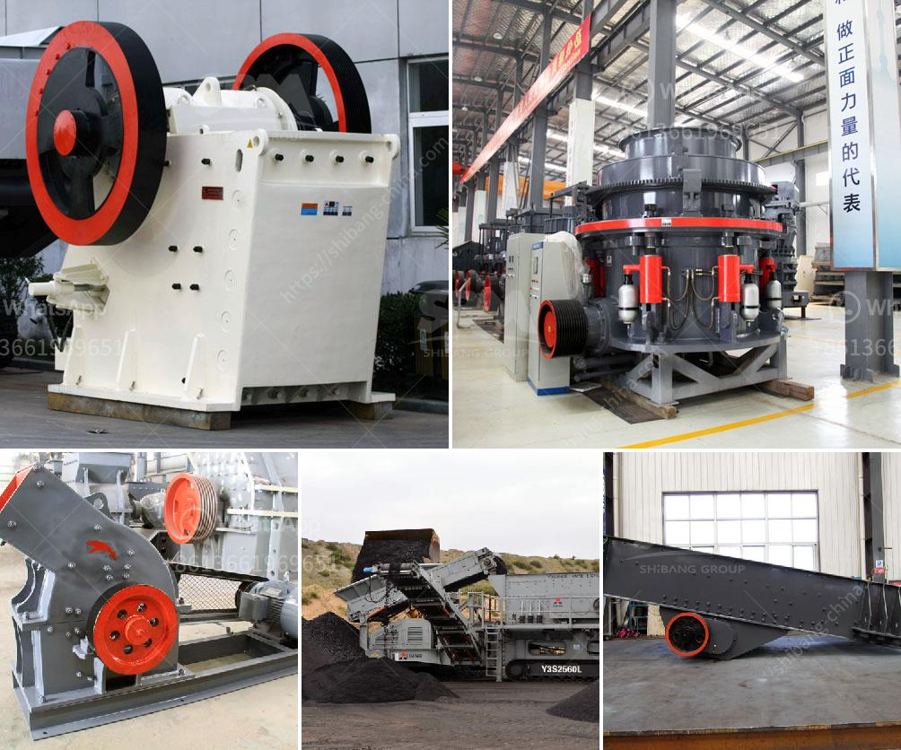

<h3>clay crusher manufacture process</h3>
Clay, the versatile material found abundantly in nature, has been used by humans for centuries. Its unique properties make it suitable for various applications, including pottery, bricks, and even as a key component in the manufacturing of cement. However, before this clay can be transformed into a usable product, it undergoes a crushing process through specialized machinery known as clay crushers.

The manufacture process of clay crushers begins with the identification and extraction of clay deposits. The clay is then transported to a processing plant, where it is crushed to reduce its particle size and make it easier to handle. The size reduction is usually achieved through a combination of crushing and grinding operations.

The primary crusher used in the clay crusher manufacturing process is usually a jaw crusher. These machines are used to reduce large-sized clay chunks into smaller, more manageable pieces. Once crushed, the clay is fed into secondary and tertiary crushers, such as cone crushers or impact crushers, which further reduce the clay's size.

After the necessary size reduction, the clay is often screened to remove any larger impurities. This ensures that the final product is of high quality and meets the desired specifications. The screened clay is then blended with other additives, such as water, binders, or chemicals, depending on the intended use of the clay product.

The blended clay mixture is then shaped into the desired form, either by hand molding or by using automated machines. This shaping process enables the clay to take on specific shapes, such as bricks or pottery, before being dried or fired in kilns to achieve the final hardness and durability.

Manufacturing clay crushers is a specialized industry that requires expertise in materials science, engineering, and machine design. Companies involved in clay crusher manufacture must invest in research and development to constantly improve their manufacturing processes, ensuring efficiency, accuracy, and quality.

In conclusion, the manufacture process of clay crushers plays a vital role in transforming raw clay into usable products. It involves careful extraction, crushing, screening, blending, and shaping steps to produce high-quality clay products. By ensuring consistent and efficient manufacturing processes, clay crusher manufacturers contribute to the availability and versatility of this essential material in various industries.
<h3>Contact us</h3><ul><li><strong>Whatsapp:&nbsp;<a href="https://wa.me/8613661969651">+8613661969651</a></strong></li><li><a href="https://swt.shibang-china.com/?git&amp;zhl&amp;clay crusher manufacture process"><strong>Online Service(chat now)</strong></a></li></ul><h3>Related</h3><ul><li><a href='ball mill manufacturers south africa.md'>ball mill manufacturers south africa</a></li><li><a href='ball mills in solidwork.md'>ball mills in solidwork</a></li><li><a href='quartz silica pulverizer machine.md'>quartz silica pulverizer machine</a></li><li><a href='crushing plant in the philippines.md'>crushing plant in the philippines</a></li><li><a href='manufacturer of crushing equipment philippines.md'>manufacturer of crushing equipment philippines</a></li></ul>