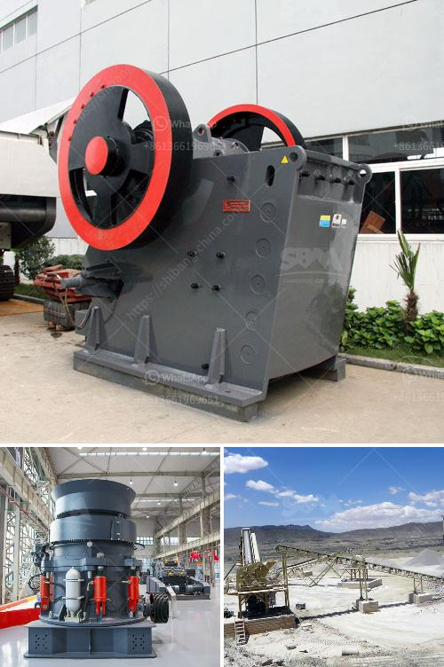

<h3>clay crusher processing in india</h3>
India is known for its vast resources of clay minerals, which are widely used in various industries. The clay crusher is the essential processing equipment for clay minerals. India has abundant clay resources and it is an important clay processing market. Various industries depend on clay for their manufacturing processes, including the ceramics, refractory, construction, and pharmaceutical industries.

The clay crusher is used to crush and reduce the size of clay minerals before further processing. These machines are specially designed to achieve maximum efficiency and reliability in clay crushing. Clay crushers are capable of handling a wide range of raw materials, including limestone, slate, gypsum, bauxite, lignite, coal, and other minerals. These machines are highly versatile and can be used in both primary and secondary crushing applications.

One of the key advantages of clay crusher processing in India is the low cost of production. India has vast clay reserves, making it an ideal location for clay processing. The availability of inexpensive labor and local machinery also contributes to lower production costs. This enables manufacturers to offer competitive prices in both domestic and international markets.

Additionally, clay crusher processing in India promotes the growth of small and medium-sized enterprises (SMEs). Clay processing units require relatively low initial investments and can be easily set up by entrepreneurs. The clay industry provides employment opportunities and generates income for local communities. Moreover, the demand for clay products, such as tiles, bricks, and pottery, continues to increase in India and abroad, creating a steady market for clay processing units.

However, it is essential to address the environmental impact of clay crusher processing. Clay mining and processing can lead to soil erosion and deforestation if not conducted responsibly. Therefore, sustainable mining practices and environmental regulations should be implemented to minimize these negative effects.

In conclusion, clay crusher processing in India plays a crucial role in supporting various industries and promoting economic growth. The abundance of clay resources, coupled with low production costs, makes India an attractive destination for clay processing. However, it is important to balance economic gains with environmental sustainability to ensure the long-term viability of the clay industry.
<h3>Contact us</h3><ul><li><strong>Whatsapp:&nbsp;<a href="https://wa.me/8613661969651">+8613661969651</a></strong></li><li><a href="https://swt.shibang-china.com/?git&amp;zhl&amp;clay crusher processing in india"><strong>Online Service(chat now)</strong></a></li></ul><h3>Related</h3><ul><li><a href='mobile crusher ghana.md'>mobile crusher ghana</a></li><li><a href='used concrete crusher price in uk.md'>used concrete crusher price in uk</a></li><li><a href='quotation for minimum quary plant.md'>quotation for minimum quary plant</a></li><li><a href='gold crushers sale.md'>gold crushers sale</a></li><li><a href='stone crusher machine crusher.md'>stone crusher machine crusher</a></li></ul>