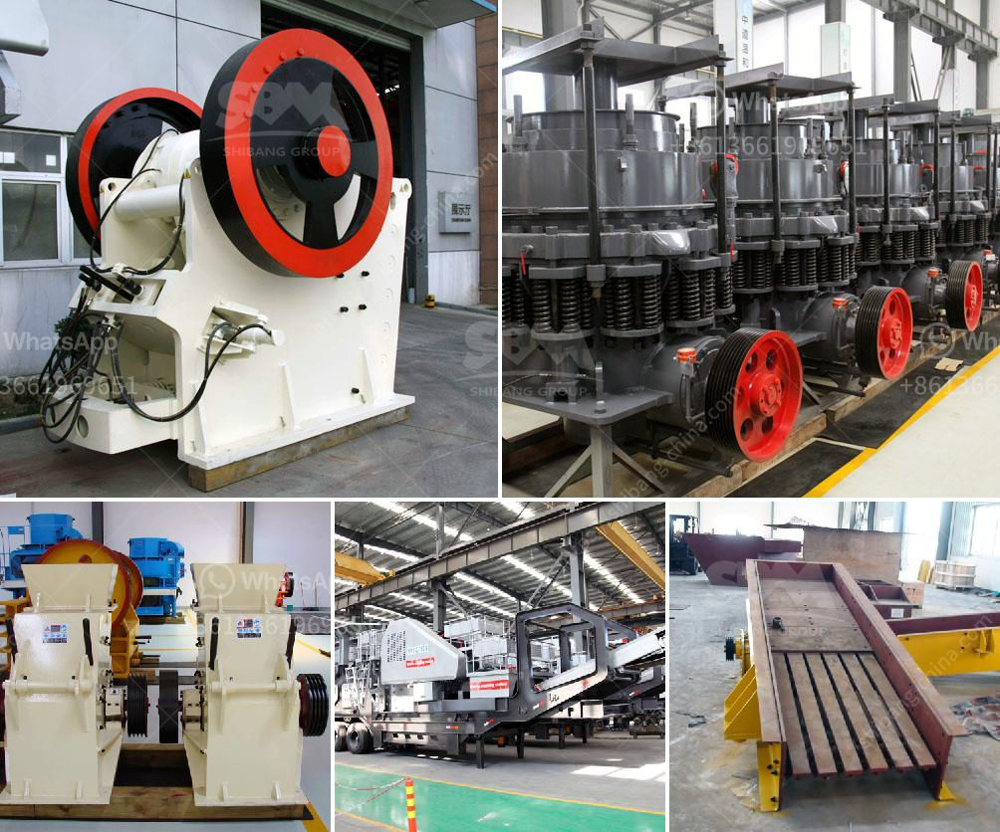

<h3>coal conveyor supplier from india</h3>
Coal has been a crucial component of the global energy mix for centuries, and India is no exception. As one of the world's largest consumers of coal, India heavily relies on this fossil fuel for power generation. A vital aspect of the coal supply chain is the uninterrupted movement of coal from mining sites to the power plants. This crucial responsibility falls on the shoulders of efficient coal conveyor suppliers in India.

India has a rich reservoir of coal resources spread across various parts of the country. However, extracting and transporting this coal to power plants requires streamlined and efficient processes. This is where Indian coal conveyor suppliers play a significant role.

These suppliers offer state-of-the-art conveyor systems tailored to handle bulk material like coal efficiently. They provide reliable and technologically advanced conveyor belts, rollers, idlers, and other components that ensure seamless coal transportation across long distances.

1. Increased Productivity: High-capacity conveyor systems allow for quick and continuous coal movement, reducing downtime and maximizing power plant productivity.

2. Cost-effectiveness: Conveyor systems reduce the reliance on manual labor, resulting in significant cost savings over time.

3. Environmentally Friendly: By reducing manual handling, conveyor systems minimize the risk of coal spillage and subsequent pollution, ensuring a safer and cleaner environment.

4. Improved Safety: Modern coal conveyors minimize accidents and injuries associated with manual handling, protecting workers and enhancing workplace safety.

5. Flexibility and Customization: Indian coal conveyor suppliers provide customized conveyor solutions to suit the specific needs of different power plants, enabling efficient coal handling irrespective of plant configuration.

Indian coal conveyor suppliers play a pivotal role in ensuring efficient coal transportation, contributing to India's power generation industry. With their cutting-edge technologies and tailored solutions, they ensure the safe, reliable, and cost-effective movement of coal from mining sites to power plants. These conveyor systems not only contribute to improved productivity but also enhance workplace safety and minimize environmental impact.

In a country like India, where coal continues to be a major source of energy, the role of these conveyor suppliers remains essential in meeting the ever-increasing demand for power.  As the energy landscape transitions towards cleaner alternatives, the efficiency and reliability of coal supply chains only grow in importance, and Indian coal conveyor suppliers are at the forefront of this crucial industry.
<h3>Contact us</h3><ul><li><strong>Whatsapp:&nbsp;<a href="https://wa.me/8613661969651">+8613661969651</a></strong></li><li><a href="https://swt.shibang-china.com/?git&amp;zhl&amp;coal conveyor supplier from india"><strong>Online Service(chat now)</strong></a></li></ul><h3>Related</h3><ul><li><a href='slag powder grinding in india.md'>slag powder grinding in india</a></li><li><a href='price of raymond used for crushing the powder stones.md'>price of raymond used for crushing the powder stones</a></li><li><a href='portable sand washing machine.md'>portable sand washing machine</a></li><li><a href='rock salt mining open pit feasibility study.md'>rock salt mining open pit feasibility study</a></li><li><a href='mini stone crusher for sale.md'>mini stone crusher for sale</a></li></ul>