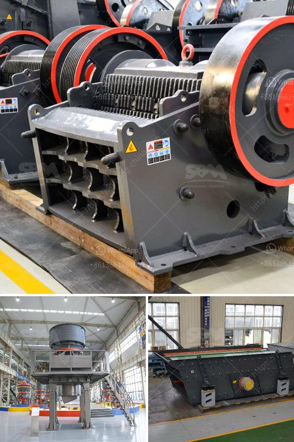

<h3>coal crusher machine manufacturers</h3>
Coal, one of the most important primary fossil fuels, has been widely used by humankind for various purposes such as energy generation, industrial applications, and domestic heating. Coal is usually mined from the earth and requires processing to convert it into a usable form. This is where coal crusher machines come into play.

Coal crusher machines are used to reduce the size of coal to a manageable size for transportation and processing purposes. They are designed to crush and break large chunks of coal into smaller pieces, hence facilitating easy handling, conveying, and processing.

The market for coal crusher machines is primarily driven by the growing demand for coal across various industries such as mining, construction, energy, and others. The power generation sector is the largest consumer of coal, followed by the industrial sector and domestic heating.

With the increasing demand for coal, coal crusher machine manufacturers have been investing heavily in the latest technologies and upgrades to meet the growing needs of the industry, and stay competitive in the market. In addition, manufacturers are also focusing on developing customized crushers for various applications.

One of the key factors driving the coal crusher machine market is the technological advancements in the mining industry. Authorities have been introducing advanced coal mining technologies to improve the productivity and efficiency of coal extraction. These technologies require advanced coal processing machinery, including crushers.

Another factor contributing to the growth of the coal crusher machine market is the rapid industrialization and urbanization worldwide. This has led to a significant increase in energy consumption and the demand for coal as a primary source of energy. As a result, the need for coal crushers has increased, leading to the expansion of the coal crusher machine manufacturing industry.

Coal crusher machine manufacturers strive for continuous innovation and research to optimize their products and services. They work closely with end-users to understand their specific requirements and develop solutions accordingly. This approach ensures that the crushers are designed to handle the diverse nature of coal, including different sizes, moisture content, and ash content.

Additionally, coal crusher machine manufacturers are also focusing on collaborations and partnerships to expand their product portfolios and geographical presence. These collaborations enable manufacturers to leverage each other's strengths and resources, leading to the development of superior products.

Environmental concerns regarding coal extraction and usage have pushed coal crusher machine manufacturers to develop more eco-friendly solutions. They are incorporating advanced technologies to minimize the emission of harmful gases and dust during the crushing process. This not only helps in reducing the environmental impact but also improves the overall safety and health conditions for workers.

In conclusion, coal crusher machine manufacturers play a crucial role in the mining industry and the overall economy. Their innovative and sustainable solutions facilitate efficient coal processing, ensuring a continuous supply of coal to meet the growing energy demands. With ongoing technological advancements and collaborations, the coal crusher machine market is expected to witness significant growth in the coming years.
<h3>Contact us</h3><ul><li><strong>Whatsapp:&nbsp;<a href="https://wa.me/8613661969651">+8613661969651</a></strong></li><li><a href="https://swt.shibang-china.com/?git&amp;zhl&amp;coal crusher machine manufacturers"><strong>Online Service(chat now)</strong></a></li></ul><h3>Related</h3><ul><li><a href='pe series jaw crusher and ton per day.md'>pe series jaw crusher and ton per day</a></li><li><a href='sample of a business proposal for a block factory.md'>sample of a business proposal for a block factory</a></li><li><a href='vibrating screen suppliers in philippines.md'>vibrating screen suppliers in philippines</a></li><li><a href='mill crusher pigment manufacturer in kenya.md'>mill crusher pigment manufacturer in kenya</a></li><li><a href='conveyor belts for dies.md'>conveyor belts for dies</a></li></ul>