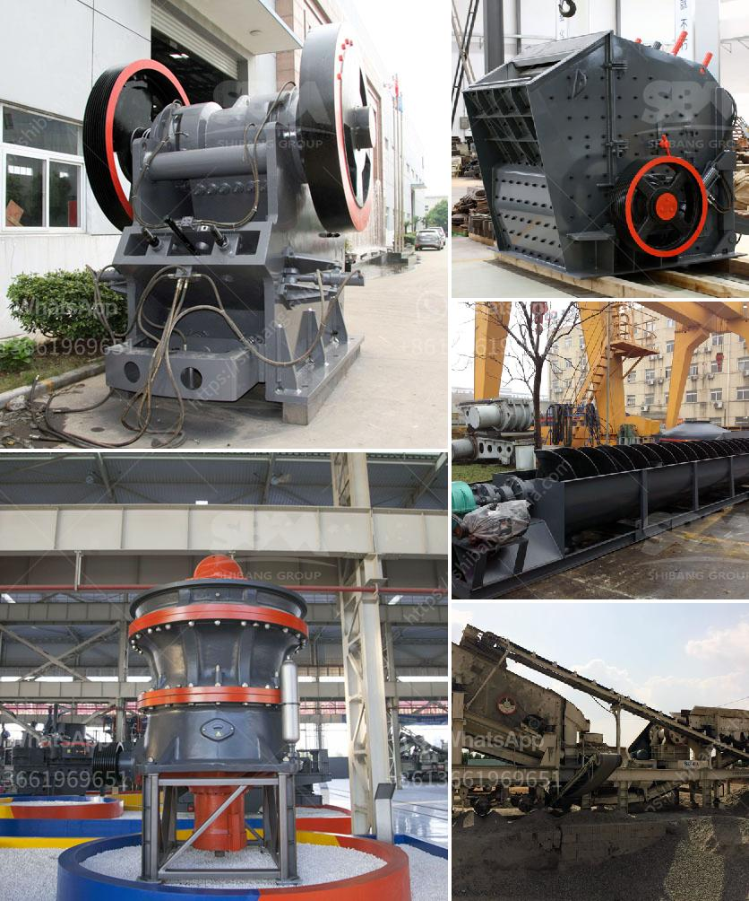

<h3>coal crusher specification pdf</h3>
Coal crusher specification pdf is one of the most important materials used in mining, whether it be for coal or other minerals. This article focuses on explaining its importance and specification in detail.

Coal crusher specification pdf is widely used in various industries, such as mining, construction, road construction, building materials, chemical industry, and other industries. It is suitable for crushing ores and rocks with medium hardness and above. It has features of reliable structure, high productivity, easy adjustment, and low operating cost.

The coal crusher specification pdf mainly consists of rotor assembly, hammer, counterattack lining board, plate hammer hitting chamber, sieve plate, etc. Its structure is simple and easy to use. The coal crusher specification pdf has the ability to minimize the moisture content of raw material and to produce high-strength and high-quality coal with uniform particle size.

The coal crusher specification pdf is a kind of impact crusher, which is used for the crushing of medium hard and brittle materials, such as coal, gangue, shale, sulfur ore, phosphate rock, etc. It is widely used in mining, metallurgy, chemical industry, building materials, electric power, water conservancy, transportation and other industries. It is suitable for the crushing of coal and rock with compressive strength less than 250Mpa and moisture content less than 15%.

The coal crusher specification pdf is composed of a crushing chamber, a rotor assembly, a hammer, a back lining plate, a sieve plate, a spindle mechanism, a bearing, a transmission device, and a driving device.

The hammer of the coal crusher specification pdf is the driving element of the rotary rotor. It is a high-speed rotating hammer head that strikes the material fed into the crushing chamber through the feed port, and breaks it into particles of the required size. The hammer periodically strikes the material in the crushing chamber to further crush it, and the material that meets the particle size requirement is discharged through the sieve plate at the lower part of the crushing chamber. The sieve plate can be adjusted according to the required particle size.

The coal crusher specification pdf has the advantages of reasonable structure, reliable performance, low energy consumption, and convenient use and maintenance. It is an ideal crushing equipment for coal gangue, cinder, shale, etc.

In summary, the coal crusher specification pdf is a type of high-efficiency and energy-saving crusher. It is suitable for coarse, medium, and fine crushing of brittle materials with medium hardness, such as coal, limestone, dolomite, gypsum, and siltstone. It is widely used in coal mines, coal preparation plants, and power plants. It is an important system to improve the efficiency of coal mining and coal utilization by effectively realizing the coal crushing and screening process.
<h3>Contact us</h3><ul><li><strong>Whatsapp:&nbsp;<a href="https://wa.me/8613661969651">+8613661969651</a></strong></li><li><a href="https://swt.shibang-china.com/?git&amp;zhl&amp;coal crusher specification pdf"><strong>Online Service(chat now)</strong></a></li></ul><h3>Related</h3><ul><li><a href='sample gold processing and mining business plan pdf.md'>sample gold processing and mining business plan pdf</a></li><li><a href='cement plant layout consultants in south africa.md'>cement plant layout consultants in south africa</a></li><li><a href='recycled crushed concrete 20mm.md'>recycled crushed concrete 20mm</a></li><li><a href='sp 60x100 jaw crusher.md'>sp 60x100 jaw crusher</a></li><li><a href='pebble crusher for sale.md'>pebble crusher for sale</a></li></ul>