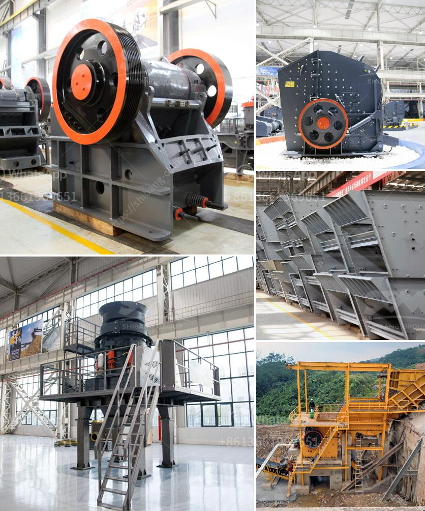

<h3>coal crushing plant</h3>
Coal, a fossil fuel resource, plays an important role in the global energy industry. Coal is primarily used as a solid fuel to produce electricity and heat through combustion. It is also used as a fuel for industrial purposes, such as refining metals. Coal crushing plant is the key equipment in coal mining project.

Coal crushing plant mainly includes many coal equipments. From Kefid you may get coal crusher and coal mill. Jaw crusher is easily the most commonly used coal crusher machine in coal handling process. Based on our experience, we realize that jaw crusher is requested the content of huge waste rock solid or brown coal of the broken iron.

Being a primary crusher of coal crushing plant, Kefid jaw crusher can reach the crushing ratio of 4-6 and the shape of final product is even. It is widely applied to crush high hardness, mid hardness and soft rocks and ores for example slag, construction materials, marble, etc. The pressure resistance strength is under 200Mpa, that is, suitable for primary crush. Jaw crusher can be used in coal crushing plant.

In order to achieve the best efficiency with our equipment, we take into consideration the grades of coal and a competent analysis of the feed. The crushing station can be composed of coarse crushing, secondary crushing and fine crushing according to actual needs. The crushing station can be combined into a two-stage crushing and screening system with coarse and fine crushing or three-stage crushing and screening system with coarse, medium, and fine crushing.

Kefid developed complete series of coal crushing plant with 100-300 tph for sale, such as jaw crusher, impact crusher, cone crusher, gyratory crusher, VSI crusher etc. They are available in stationary, portable and mobile applications, and suitable for all crushing needs from mining to contracting, and from extremely hard rock to recycling materials. With more than 20 years' experience in coal crushing plant, Kefid is a reliable manufacturer and supplier of all kinds of coal crushing equipment in the world.
<h3>Contact us</h3><ul><li><strong>Whatsapp:&nbsp;<a href="https://wa.me/8613661969651">+8613661969651</a></strong></li><li><a href="https://swt.shibang-china.com/?git&amp;zhl&amp;coal crushing plant"><strong>Online Service(chat now)</strong></a></li></ul><h3>Related</h3><ul><li><a href='quarry crusher equipments and machinery.md'>quarry crusher equipments and machinery</a></li><li><a href='mobile stone crusher for sale philippines.md'>mobile stone crusher for sale philippines</a></li><li><a href='gypsum production in visakhapatnam.md'>gypsum production in visakhapatnam</a></li><li><a href='cost of setting up a quarry crusher in nigeria.md'>cost of setting up a quarry crusher in nigeria</a></li><li><a href='silica sand refind machines in germany.md'>silica sand refind machines in germany</a></li></ul>