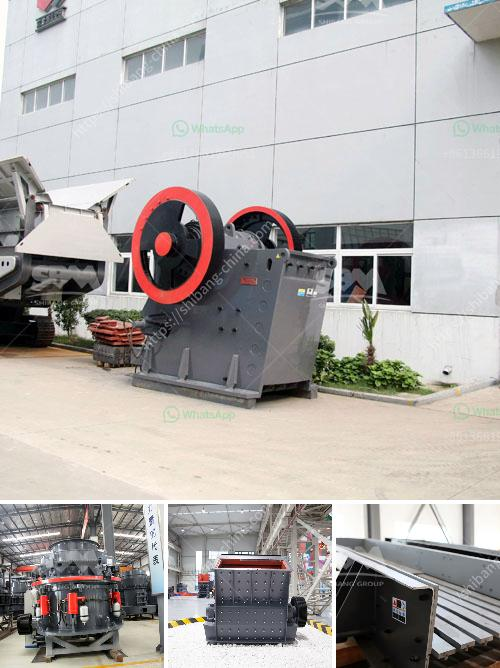

<h3>coal grinding mill</h3>
Coal grinding mills are machines that are used to pulverize and dry coal before it is blown into the power plant furnace. The coal is fed into the mill through a central inlet pipe, where it is then crushed and ground by a series of rollers and a rotating table. As the coal particles are ground to a fine powder, they are subsequently blown into the combustion chamber of the power plant, where they are ignited to generate heat and electricity.

One of the key components of a coal grinding mill is the grinding media, which refers to the balls and rods used to grind the coal within the mill. The grinding media must be able to crush and grind the coal effectively, ensuring optimal combustion efficiency and environmental performance. In addition to the grinding media, the grinding mill must also be equipped with other essential components, such as a feeding device, a classifying liner, and a dust collection system.

The feeding device is responsible for ensuring a stable and consistent supply of coal to the mill. It typically consists of a belt conveyor or a screw conveyor that transports the coal from a storage silo to the mill inlet. The classifying liner, on the other hand, helps to separate the ground coal particles from the larger and heavier coal balls, ensuring that only the finest particles are blown into the combustion chamber. Finally, the dust collection system is essential for maintaining a clean and safe working environment inside the mill, as it collects and removes any airborne coal dust or particulate matter.

When selecting a coal grinding mill, several factors must be taken into consideration. The size and moisture content of the coal, for example, can significantly affect the grinding performance of the mill. A coal with a higher moisture content may require additional drying before it can be pulverized, while a larger coal particle size may necessitate the use of larger grinding media or a different mill configuration.

Another important factor to consider is the desired fineness of the ground coal. Different types of pulverized coal boilers have different requirements for coal fineness, and the grinding mill must be capable of producing the desired fineness consistently. The grinding mills are typically equipped with a dynamic classifier, which divides the pulverized coal particles into a coarse fraction that returns to the grinding zone for further comminution and a fine fraction that is entrained in the combustion air and blown into the furnace.

In conclusion, coal grinding mills play a critical role in the efficient and clean combustion of coal in power plants. They crush, grind, and pulverize coal to a fine powder, which is then blown into the combustion chamber for combustion. The selection of the appropriate grinding mill and its components is essential for ensuring optimal grinding performance, combustion efficiency, and environmental performance. With the increasing emphasis on reducing carbon emissions and increasing the efficiency of coal-fired power plants, coal grinding mills are expected to continue evolving to meet these challenges.
<h3>Contact us</h3><ul><li><strong>Whatsapp:&nbsp;<a href="https://wa.me/8613661969651">+8613661969651</a></strong></li><li><a href="https://swt.shibang-china.com/?git&amp;zhl&amp;coal grinding mill"><strong>Online Service(chat now)</strong></a></li></ul><h3>Related</h3><ul><li><a href='portable gold wash plant for sale usa.md'>portable gold wash plant for sale usa</a></li><li><a href='lime stone crusher section in cement plant pdf.md'>lime stone crusher section in cement plant pdf</a></li><li><a href='metal crusher machine for rent in sri lanka.md'>metal crusher machine for rent in sri lanka</a></li><li><a href='nigeria rock crusher for sale.md'>nigeria rock crusher for sale</a></li><li><a href='crusher machine from south korea.md'>crusher machine from south korea</a></li></ul>