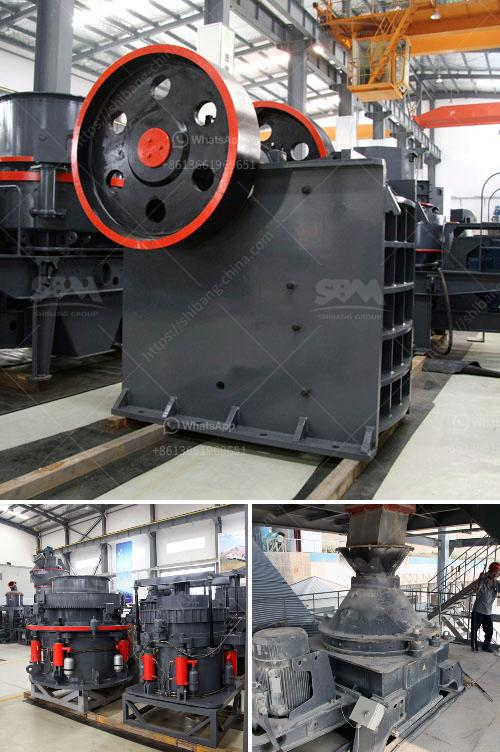

<h3>coal milling machine</h3>
Coal milling machine, also known as a pulverizer, grinds coal into a fine powder for use in thermal power plants and other industrial applications. Based on the principles of attrition and impact, it consists of a rotary drum equipped with segments, each containing a grinding medium. Due to the rotation of the drum, the coal is crushed and ground, while the larger particles are recirculated for further grinding.

One of the key advantages of a coal milling machine is its versatility. It can grind a wide range of coal types, from soft bituminous coals to hard anthracites and petroleum coke. This adaptability ensures that the machine can meet the varying requirements of coal-fired power plants.

Another significant benefit of a coal milling machine is its efficiency. These machines are designed to achieve high grinding efficiency while consuming minimal power. By reducing the size of coal particles, more surface area is exposed, resulting in improved combustion efficiency and reduced emissions. This is particularly crucial in today's environmentally conscious world, where sustainability is an integral part of every industry.

Moreover, coal milling machines are equipped with advanced control systems that allow for precise control of the grinding process. Operators can easily adjust the machine's settings to optimize its performance for different coal types and desired particle sizes. This ensures consistent quality of the coal powder, making it suitable for a wide range of applications.

In conclusion, a coal milling machine plays a vital role in the coal-fired power generation process. Its ability to grind coal into a fine powder ensures efficient combustion and reduced emissions. With its versatility and advanced control systems, it offers a reliable and adaptable solution for coal milling requirements in various industries.
<h3>Contact us</h3><ul><li><strong>Whatsapp:&nbsp;<a href="https://wa.me/8613661969651">+8613661969651</a></strong></li><li><a href="https://swt.shibang-china.com/?git&amp;zhl&amp;coal milling machine"><strong>Online Service(chat now)</strong></a></li></ul><h3>Related</h3><ul><li><a href='mobile crusher in saudi arabia.md'>mobile crusher in saudi arabia</a></li><li><a href='vertical roller mill in cement plant.md'>vertical roller mill in cement plant</a></li><li><a href='how to calculate the operating cost of a stone crusher.md'>how to calculate the operating cost of a stone crusher</a></li><li><a href='crushing equipment in south africa.md'>crushing equipment in south africa</a></li><li><a href='alluvial wash plants in south africa.md'>alluvial wash plants in south africa</a></li></ul>