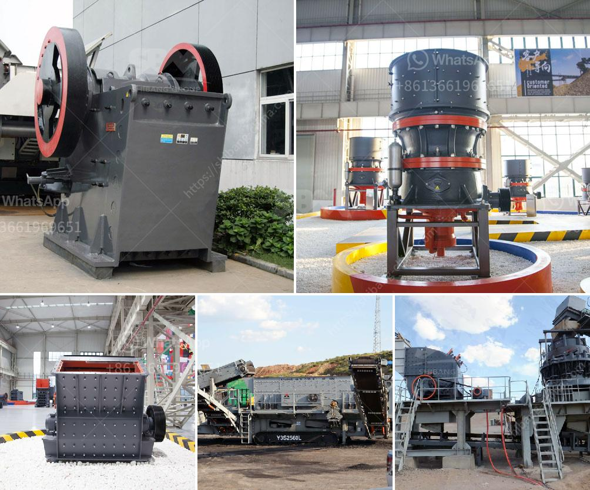

<h3>coal mining coal equipment coal mine equipment</h3>
Coal mining, the process of extracting coal from the ground, is a vital and heavily relied upon industry in many countries. It plays a crucial role in meeting the global energy demand, providing heat and electricity generation for homes, businesses, and industries.

To efficiently carry out coal mining, specialized equipment is required. Coal mine equipment refers to machinery, tools, and equipment used in the extraction, transportation, and processing of coal. These devices assist in removing the overlying soil and rock layers to expose the coal seams, ensuring safe and productive digging.

One essential component of coal mine equipment is the continuous miner. This machine is responsible for cutting and loading coal onto shuttle cars or conveyors. It features a rotating drum with teeth that penetrate the coal seam, chipping away at the coal and moving it onto a conveyor belt or into a shuttle car. Continuous miners are integral to the mining process, making it more efficient and reducing the risk of accidents.

Another critical equipment in coal mining is the longwall shearer. This massive machine operates underground and is used for cutting the coal from the face of the mine. The longwall shearer consists of a rotating drum fitted with numerous cutting picks that mechanically extract the coal, allowing for a continuous and productive operation.

Coal mining also relies on various auxiliary equipment to facilitate the mining process. These include rock drills, roof bolters, conveyors, and hydraulic support systems. Rock drills are utilized to bore holes into the rock, enabling the insertion of explosives for controlled coal extraction. Roof bolters secure the mine roof to prevent cave-ins, ensuring the safety of workers. Conveyors transport coal to the surface or to processing facilities, and hydraulic support systems provide stability to the mine's walls and roof.

The efficiency and safety of coal mining heavily rely on the reliable functioning of coal mine equipment. With advancements in technology, equipment has become more sophisticated, offering increased productivity and reducing the number of workers required underground. Additionally, modern coal mine equipment incorporates safety features such as methane gas detectors and ventilation systems to minimize risks associated with coal mining.

In conclusion, coal mine equipment is essential in the extraction, transportation, and processing of coal. From continuous miners and longwall shearers to auxiliary devices, modern equipment has revolutionized the industry, making coal mining safer and more efficient. As we continue to rely on coal as a significant energy source, further developments in coal mine equipment will likely continue to improve mining operations around the world.
<h3>Contact us</h3><ul><li><strong>Whatsapp:&nbsp;<a href="https://wa.me/8613661969651">+8613661969651</a></strong></li><li><a href="https://swt.shibang-china.com/?git&amp;zhl&amp;coal mining coal equipment coal mine equipment"><strong>Online Service(chat now)</strong></a></li></ul><h3>Related</h3><ul><li><a href='cost for a metal crusher in kerala.md'>cost for a metal crusher in kerala</a></li><li><a href='project cost of mini cement plant in india.md'>project cost of mini cement plant in india</a></li><li><a href='dicalcium phosphate process hydrochloric acid flow chart.md'>dicalcium phosphate process hydrochloric acid flow chart</a></li><li><a href='silica sand grinding machine cost.md'>silica sand grinding machine cost</a></li><li><a href='china dahua series jaw crusher.md'>china dahua series jaw crusher</a></li></ul>