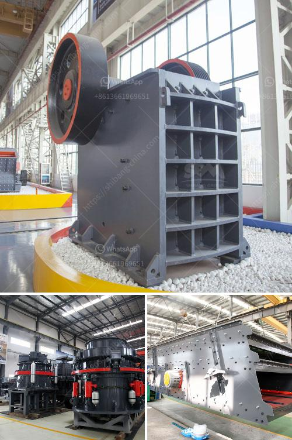

<h3>coal mining machinery used</h3>
Coal, one of the most significant energy sources globally, has played a vital role in powering industries and fueling economies for centuries. And behind every ton of coal extracted lies a collective effort of manpower and machinery. Over the years, coal mining machinery has evolved and transformed, revolutionizing the coal industry and making it more efficient and safer.

In the early days of coal mining, human labor was primarily employed to extract coal from the depths of the earth. However, as the industry expanded and the demand for coal increased, manual labor became inefficient and insufficient to meet the rising needs. This necessity led to the development and introduction of innovative machinery specifically designed for coal mining.

One of the most iconic machines used in coal mining is the Continuous Miner. It is a mobile machine with a large drum equipped with numerous rotating cutting bits. As the machine moves forward, it continuously cuts coal from the seam, which is then loaded onto a conveyor belt or shuttle car for transportation to the surface. The Continuous Miner greatly enhances productivity and safety, as it replaces the need for manual labor in coal extraction.

In addition to the Continuous Miner, another essential machinery used in coal mining is the Longwall Shearer. This cutting-edge machine is used in underground coal mines and is designed to extract thick coal seams efficiently. It operates by mechanically cutting the coal from the wall of the mine in a precise and automated fashion, eliminating the need for manual drilling or blasting. The Longwall Shearer has significantly increased productivity and efficiency in underground coal mining.

Furthermore, modern coal mining machinery also includes Coal Haulers and Roof Bolters. The Coal Haulers are used to transport extracted coal within the mine, reducing the reliance on manual labor and improving efficiency. Roof Bolters, on the other hand, are machines specifically designed to drill bolts into the rock ceiling of coal mines, ensuring the stability and safety of the mine's roof.

Moreover, advancements in technology have further revolutionized the coal mining machinery industry. Various sensors, global positioning systems (GPS), and automated controls are now integrated into these machines, enabling precise operations, monitoring, and data collection. This technological integration has not only improved productivity but also enhanced safety by reducing the risk of accidents and improving ventilation control.

In conclusion, coal mining machinery has undoubtedly transformed the coal industry by increasing productivity, improving safety, and reducing the reliance on manual labor. The introduction of machines like Continuous Miners, Longwall Shearers, and Roof Bolters has revolutionized coal extraction methods. With ongoing advancements in technology, coal mining machinery continues to evolve, ensuring that the coal industry remains efficient, sustainable, and indispensable for meeting the world's growing energy demands.
<h3>Contact us</h3><ul><li><strong>Whatsapp:&nbsp;<a href="https://wa.me/8613661969651">+8613661969651</a></strong></li><li><a href="https://swt.shibang-china.com/?git&amp;zhl&amp;coal mining machinery used"><strong>Online Service(chat now)</strong></a></li></ul><h3>Related</h3><ul><li><a href='chinese aggregate crusher suppliers.md'>chinese aggregate crusher suppliers</a></li><li><a href='small ball mill for cement clinker grinding india.md'>small ball mill for cement clinker grinding india</a></li><li><a href='small stone crusher supplier in the philippines.md'>small stone crusher supplier in the philippines</a></li><li><a href='company profile for suppliers of mining equipment.md'>company profile for suppliers of mining equipment</a></li><li><a href='how to design stone crusher building.md'>how to design stone crusher building</a></li></ul>