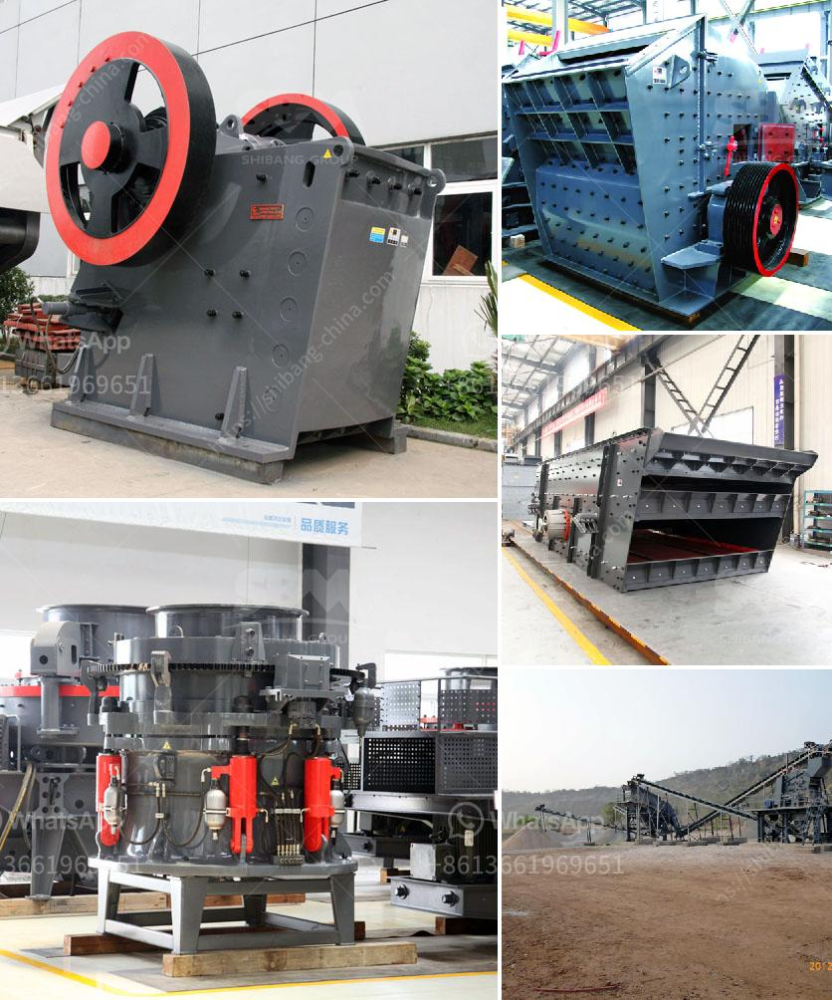

<h3>coal mining machines in india</h3>
Coal mining machines are in high demand in India as the country grapples with the ever-increasing demand for coal. Coal is used as a crucial source of energy in India, and the need for its extraction has never been higher. With the rising demand, the need for advanced coal mining machines has become paramount.

India is the world's second-largest coal producer, and its coal industry has been a major contributor to the country's economic growth. However, coal mining in India has faced numerous challenges due to outdated machinery and archaic mining practices. The use of outdated equipment has not only hindered the productivity of coal mines but also posed significant safety risks to miners.

To overcome these challenges, the coal mining industry in India has embraced modern technology and machinery. Advanced coal mining machines have made the extraction process more efficient and safe for miners. These machines are equipped with state-of-the-art technology such as sensors, GPS tracking systems, and automated controls, which allow for precise and controlled mining operations.

Moreover, the introduction of these machines has improved the overall productivity of coal mines in India. With the ability to extract coal more effectively, the industry can meet the increasing demand for coal and accelerate the economic growth of the nation.

In addition, the use of modern machines has significantly improved the safety standards in coal mines. These machines are designed to minimize the exposure of miners to hazardous conditions, reducing the risk of accidents and fatalities. With advanced safety features, such as gas detection systems and emergency shut-off mechanisms, the well-being of miners is prioritized.

However, despite the benefits of these machines, there are still challenges that need to be addressed. The high cost of acquiring advanced coal mining machines remains a significant barrier for many mining companies, especially those operating on a smaller scale. Additionally, the need for proper training and skill development of workers to operate and maintain these machines is crucial.

In conclusion, the use of coal mining machines in India has revolutionized the industry and increased its efficiency and safety standards. These machines not only enhance the productivity of coal mines but also ensure the well-being of miners. As the demand for coal continues to rise, it is imperative for the coal mining sector to invest in and adopt advanced mining technologies to meet the growing needs of the nation.
<h3>Contact us</h3><ul><li><strong>Whatsapp:&nbsp;<a href="https://wa.me/8613661969651">+8613661969651</a></strong></li><li><a href="https://swt.shibang-china.com/?git&amp;zhl&amp;coal mining machines in india"><strong>Online Service(chat now)</strong></a></li></ul><h3>Related</h3><ul><li><a href='concrete plants for sale in spain.md'>concrete plants for sale in spain</a></li><li><a href='cone crusher machine for sale.md'>cone crusher machine for sale</a></li><li><a href='saudi arabia used conveyor belts price.md'>saudi arabia used conveyor belts price</a></li><li><a href='stone crusher machine crusher.md'>stone crusher machine crusher</a></li><li><a href='granite rock sand machinery.md'>granite rock sand machinery</a></li></ul>