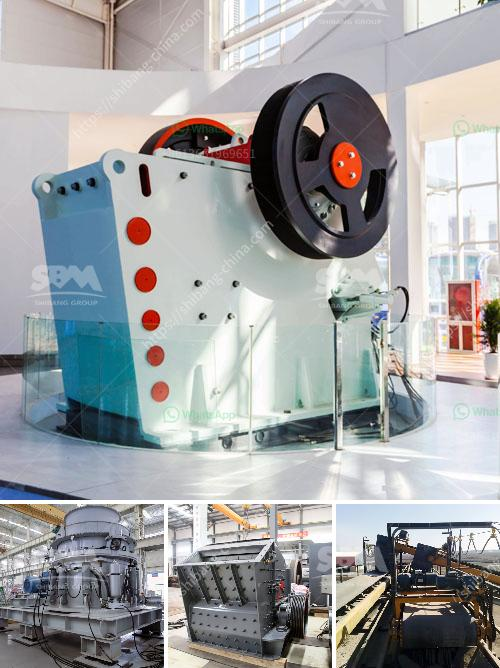

<h3>coal powder making</h3>
Coal has been a valuable source of energy for centuries, being widely used in the industrial and power sectors. As the demand for electricity continues to grow, so does the need for efficient coal utilization. One crucial step in this process is coal powder making, which involves grinding coal into fine particles to improve combustion efficiency.

Coal powder making, also known as pulverization, plays a vital role in enhancing the overall performance of coal-fired power plants and other industries that rely on coal as a fuel source. This process involves reducing the size of coal chunks or lumps into smaller particles through crushing and grinding equipment. The resulting coal powder, with its increased surface area, facilitates better combustion and heat release during combustion processes, leading to improved energy production and reduced emissions.

To achieve the desired coal particle size, several techniques are commonly employed in coal powder making. One common method is the use of ball mills, wherein the coal is ground by rotating steel balls within a cylindrical drum. The grinding process imparts kinetic energy to the coal particles, causing them to collide and break down into fine powder. The size of coal particles can be further controlled by adjusting the ball mill parameters such as rotation speed, ball size, and feed rate.

Another technique used in coal powder making is pulverizers, which are high-speed machines that crush coal into fine particles. Pulverizers consist of grinding plates or hammers that rotate at high speeds, effectively pulverizing the coal as it passes through the machine. The resulting coal powder can be classified into different sizes using sieves or classifiers.

Coal powder making not only enhances the combustion efficiency but also ensures the proper handling and transportation of coal. By reducing the size of coal, it becomes easier to transport, store, and feed into boilers or furnaces. The smaller particle size enables a more uniform distribution of coal particles, optimizing the coal-air mixture required for efficient combustion. Moreover, coal powder making decreases the risks associated with coal dust explosions by reducing the presence of fine coal particles in the environment.

Furthermore, advancements in technology have led to the development of more efficient and sustainable coal powder making processes. Emerging techniques, such as dry grinding and ultrafine grinding, offer improved energy efficiency and product quality. Dry grinding eliminates the need for water in the grinding process, reducing water consumption and associated environmental impacts. Ultrafine grinding enables the production of extremely fine coal particles, further enhancing combustion efficiency and reducing emissions.

Despite the global shift towards cleaner energy sources, coal remains an essential component of the world's energy mix. By incorporating efficient coal powder making techniques, the energy sector can improve its environmental performance while ensuring a reliable and cost-effective energy supply. Continued research and innovation in coal powder making are essential to maximize the potential of this valuable resource while minimizing its environmental footprint.

In conclusion, coal powder making is a fundamental process that enhances the performance and efficiency of coal-fired power plants and industries reliant on coal. By reducing coal chunks into fine particles, combustion efficiency is improved, leading to enhanced energy production and reduced emissions. This process not only optimizes coal handling and combustion but also offers opportunities for sustainable practices and innovation in the coal industry. With technological advancements, coal powder making continues to evolve, ensuring a reliable and cleaner energy future for generations to come.
<h3>Contact us</h3><ul><li><strong>Whatsapp:&nbsp;<a href="https://wa.me/8613661969651">+8613661969651</a></strong></li><li><a href="https://swt.shibang-china.com/?git&amp;zhl&amp;coal powder making"><strong>Online Service(chat now)</strong></a></li></ul><h3>Related</h3><ul><li><a href='crusher machine seller.md'>crusher machine seller</a></li><li><a href='sand washing machine price.md'>sand washing machine price</a></li><li><a href='stone crusher machines manufactures in china.md'>stone crusher machines manufactures in china</a></li><li><a href='used quarry equipment from usa.md'>used quarry equipment from usa</a></li><li><a href='cost of setting up a quarry crusher in nigeria.md'>cost of setting up a quarry crusher in nigeria</a></li></ul>