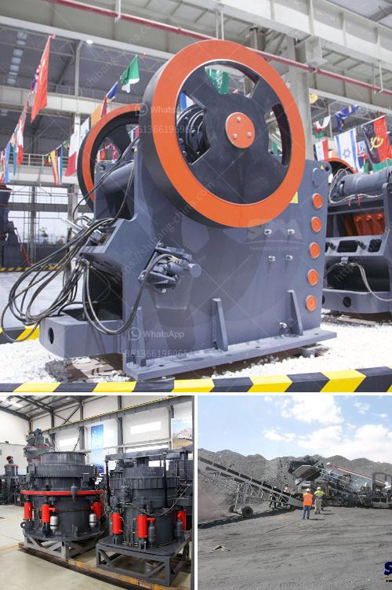

<h3>coal processing plant</h3>
Coal has been an essential source of energy for centuries, powering industries and homes across the globe. However, the extraction and utilization of coal come with environmental concerns, prompting the establishment of coal processing plants. These plants play a pivotal role in the energy industry by refining and converting coal into various forms, reducing its environmental impact while ensuring a reliable supply of energy.

A coal processing plant is a facility that washes coal of soil and rock, crushes it into graded-sized chunks, and prepares it for transportation. Depending on the desired end use, coal can undergo several processes like blending, grinding, and even gasification. These plants employ high-tech equipment and advanced techniques to enhance the quality of coal, making it cleaner and more efficient.

One of the primary objectives of a coal processing plant is to improve the quality of coal by removing impurities like rock, sulfur, and other contaminants. This is achieved through various methods, such as dense medium separation, which involves immersing coal in a fluid with a density between coal and rock, causing the rock to sink. Another common method is froth flotation, where fine coal particles are separated from impurities using air bubbles.

The processed coal is often utilized across different industries for electricity production, steel manufacturing, cement production, and more. By transforming coal into cleaner and more refined forms, coal processing plants contribute to reducing emissions and improving air quality. For instance, by removing sulfur from coal, these plants can significantly decrease sulfur dioxide emissions, which is a major cause of acid rain and respiratory illnesses.

In addition to environmental benefits, coal processing plants also ensure a steady supply of energy. With modern technologies, coal can be transformed into synthetic gas or liquid fuels, enabling its utilization in power generation, transportation, and even chemical production. This versatility proves crucial during disruptions in other energy sources, ensuring an uninterrupted supply of energy.

In conclusion, coal processing plants play a vital role in the energy industry by refining coal, improving its quality, and transforming it into different forms. These plants adhere to high environmental standards, reducing emissions and enhancing the sustainability of coal utilization. Additionally, they guarantee a consistent source of energy, even during energy crises. As the world progresses towards a greener future, coal processing plants continue to be an essential player, bridging the gap between traditional energy sources and sustainable alternatives.
<h3>Contact us</h3><ul><li><strong>Whatsapp:&nbsp;<a href="https://wa.me/8613661969651">+8613661969651</a></strong></li><li><a href="https://swt.shibang-china.com/?git&amp;zhl&amp;coal processing plant"><strong>Online Service(chat now)</strong></a></li></ul><h3>Related</h3><ul><li><a href='mobile crushers for sale in nigeria.md'>mobile crushers for sale in nigeria</a></li><li><a href='raymond pulverizer mill pdf.md'>raymond pulverizer mill pdf</a></li><li><a href='chrome crusher machine price list.md'>chrome crusher machine price list</a></li><li><a href='slag ball mill crusher.md'>slag ball mill crusher</a></li><li><a href='ball mill balls suppliers.md'>ball mill balls suppliers</a></li></ul>