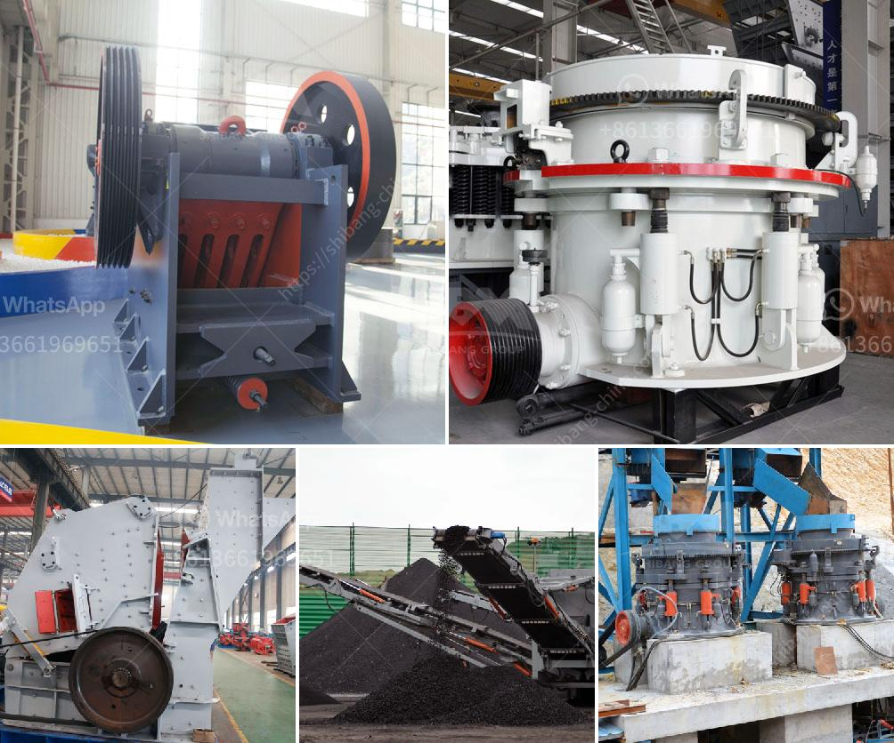

<h3>coal processing plants</h3>
Coal, a fossil fuel formed from the remains of plants that lived and died millions of years ago, has been a significant energy source globally. Its extensive usage can be attributed to its abundance, cost-effectiveness, and energy density. However, harnessing the power from coal requires an intricate process involving coal processing plants, which play a vital role in cleaning, sorting, and preparing the fuel for various applications.

Coal processing plants, also known as coal preparation plants or coal handling plants, are facilities where coal is washed, crushed, and sorted into different sizes for different industrial uses. The primary objective of these plants is to remove impurities from the coal, making it suitable for efficient combustion or conversion into other valuable products.

One of the crucial processes carried out at coal processing plants is coal washing, which involves the removal of impurities, such as rock, ash, sulfur, and other minerals that are present in the raw coal. Coal washing utilizes techniques like gravity separation, dense medium separation, and flotation to separate the impurities from the coal. By removing these impurities, the energy value of the coal is increased, reducing emissions and improving combustion efficiency.

After coal washing, the coal is often crushed into smaller sizes to facilitate handling and transportation. Crushing the coal helps to increase its surface area, making it easier to mix with air and burn efficiently. The crushed coal may then undergo further processing to remove moisture, as excessive moisture content reduces the heat output and overall energy efficiency of the coal.

Sorting is another important aspect of coal processing plants, as it categorizes the coal into different sizes and qualities. The sorted coal can be sent for industrial use, such as electricity generation, steel production, or as a feedstock for coal liquefaction and gasification processes. Each industrial application requires specific coal qualities to optimize energy efficiency, reduce emissions, and meet regulatory standards. Sorting ensures that the appropriate coal is used for a particular purpose.

While coal processing plants have been helping to harness the energy from coal for decades, modern advancements have made them more efficient and environmentally friendly. Technologies like cleaner coal combustion systems, carbon capture, storage, and utilization (CCS/CCUS), and other emission control technologies are being integrated into coal processing plants to minimize the environmental impact of coal-based energy generation.

Furthermore, coal processing plants play a crucial role in reducing environmental pollution by managing and disposing of the waste generated during the coal processing. Efforts are being made to minimize the release of harmful pollutants, such as sulfur dioxide (SO2), nitrogen oxides (NOx), and particulate matter, through the implementation of stringent emission regulations and the use of advanced emission control equipment.

In conclusion, coal processing plants are essential facilities that prepare coal for various industrial applications, ranging from electricity generation to the production of cement, steel, and other materials. Despite the growing shift towards renewable and cleaner energy sources, coal will continue to be a significant part of the global energy mix for the foreseeable future. Therefore, it is crucial to ensure that coal processing plants are equipped with the necessary technologies to extract energy from coal efficiently while minimizing its environmental impact.
<h3>Contact us</h3><ul><li><strong>Whatsapp:&nbsp;<a href="https://wa.me/8613661969651">+8613661969651</a></strong></li><li><a href="https://swt.shibang-china.com/?git&amp;zhl&amp;coal processing plants"><strong>Online Service(chat now)</strong></a></li></ul><h3>Related</h3><ul><li><a href='jaw crushers kyrgyzstan.md'>jaw crushers kyrgyzstan</a></li><li><a href='ton hour coal crusher and screen.md'>ton hour coal crusher and screen</a></li><li><a href='china coal crusher high capacity.md'>china coal crusher high capacity</a></li><li><a href='how to calculate the operating cost of a stone crusher.md'>how to calculate the operating cost of a stone crusher</a></li><li><a href='river stone crusher for sale.md'>river stone crusher for sale</a></li></ul>