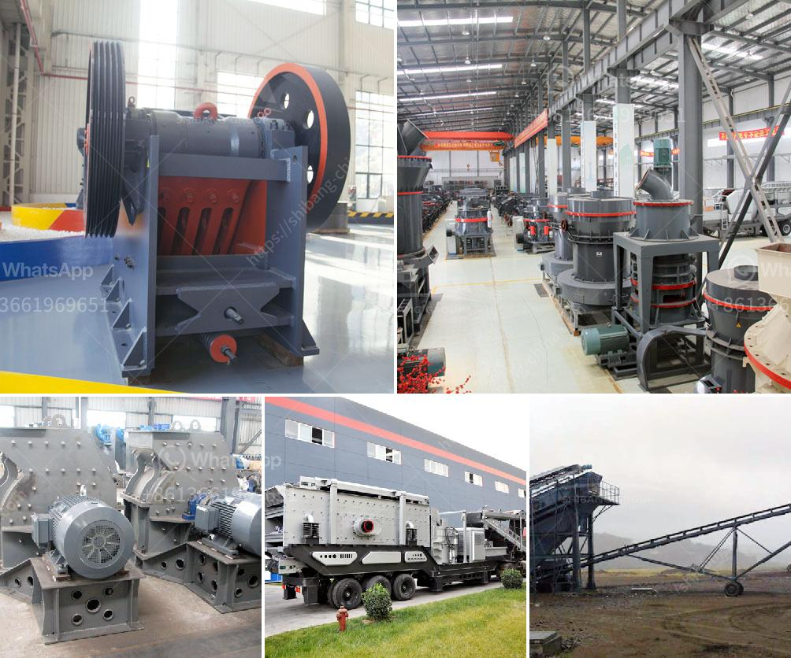

<h3>coal pulverizer manufacturers</h3>
Coal pulverizers are the machines that grind coal into fine powder for burning in power plants. These machines are used to pulverize coal into particles required for combustion or thermal power generation. They play a critical role in the functioning of power plants as they are responsible for grinding the coal and supplying it to the boiler for subsequent combustion. In this article, we will explore the importance of coal pulverizers and discuss some of the top manufacturers in the industry.

The coal pulverizer market is witnessing tremendous growth due to the increasing demand for energy and electricity across the globe. Power plants heavily rely on coal as a source of energy, and pulverizers are essential equipment for coal grinding. These machines grind coal into a fine powder, which is then burned in the boiler to generate steam and ultimately produce electricity.

Several factors contribute to the efficient functioning of coal pulverizers. These include grinding capability, fineness control, availability, reliability, and overall power consumption. The design of a coal pulverizer must balance these factors to ensure optimal performance. Manufacturers continuously strive to improve the design and performance of coal pulverizers to meet the evolving demands of the power generation industry.

Various manufacturers specialize in the production of coal pulverizers. These companies employ cutting-edge technology and engineering expertise to manufacture high-quality and efficient machines. Some of the top manufacturers in the industry are:

1. Riley Power Inc.: A subsidiary of Babcock Power Inc., Riley Power is a leading manufacturer of coal pulverizers, offering a wide range of products and services for the power generation industry. They provide complete coal grinding solutions, including design, engineering, manufacturing, and service support.

2. Mitsubishi Heavy Industries (MHI): MHI is a global leader in engineering and manufacturing. Their coal pulverizers are known for their high reliability and performance. MHI's pulverizers are widely used in power plants worldwide and are recognized for their excellent grinding efficiency and low power consumption.

3. Alstom Power: Alstom Power specializes in the development, design, manufacturing, and servicing of coal pulverizers. They provide comprehensive solutions for coal grinding, including advanced control systems and optimization techniques.

4. Babcock & Wilcox (B&W): B&W is a renowned supplier of coal pulverizer equipment. Their pulverizers are used in power plants, cement plants, and other industries for grinding and drying diverse materials.

These manufacturers invest heavily in research and development to innovate and improve their products continuously. With a focus on optimizing efficiency, reducing emissions, and increasing reliability, they strive to meet the ever-growing demands of the power industry.

In conclusion, coal pulverizers are critical equipment in power plants, responsible for grinding coal into fine powder for combustion. Several top manufacturers specialize in producing efficient and reliable coal pulverizers. These manufacturers continuously innovate their products to enhance grinding capability, optimize power consumption, and improve overall performance. As the demand for energy continues to rise, coal pulverizer manufacturers play a crucial role in providing the industry with quality equipment that contributes to the efficient generation of electricity.
<h3>Contact us</h3><ul><li><strong>Whatsapp:&nbsp;<a href="https://wa.me/8613661969651">+8613661969651</a></strong></li><li><a href="https://swt.shibang-china.com/?git&amp;zhl&amp;coal pulverizer manufacturers"><strong>Online Service(chat now)</strong></a></li></ul><h3>Related</h3><ul><li><a href='basalt rebar production line.md'>basalt rebar production line</a></li><li><a href='quartz powder making.md'>quartz powder making</a></li><li><a href='stone crusher machine rentals in ghana.md'>stone crusher machine rentals in ghana</a></li><li><a href='machinery required for stone crusher.md'>machinery required for stone crusher</a></li><li><a href='granite gypsum quarry.md'>granite gypsum quarry</a></li></ul>