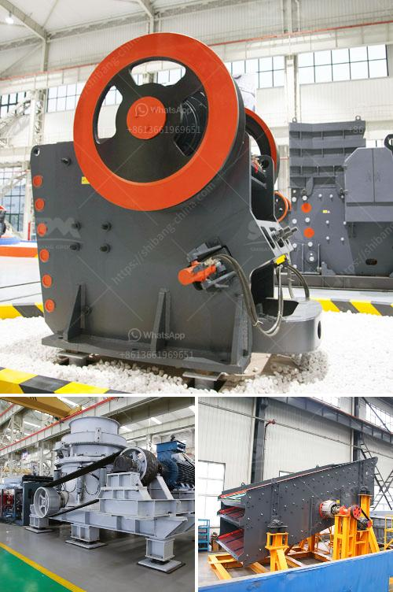

<h3>coal screening plant</h3>
Coal screening plant plays a vital role in the coal processing workflow. As the name suggests, a coal screening plant is used to separate coal into different sizes, ensuring optimal combustion efficiency and reducing environmental pollution. This essential process makes coal suitable for various industries such as power plants, steel mills, and cement plants, contributing to their smooth operation.

In the coal processing industry, the procedures of coal crushing and screening are crucial to maintaining efficient and sustainable use of this vital energy source. Coal needs to be crushed into different sizes to ensure optimal combustion efficiency in boilers or furnaces. After the crushing process, the coal needs to be screened to separate the desired-sized coal from the larger rocks, stones, and other impurities. This is where the coal screening plant comes into play.

A coal screening plant typically consists of a series of screens or decks positioned in a precise manner to ensure maximum efficiency. Vibrating screens are commonly used for this purpose, as they efficiently separate the coal into different sizes based on the mesh size of the screens. By using different screen sizes, the coal screening plant can ensure the right-sized coal is directed to the appropriate location. Oversized coal can be returned to the crusher for further crushing, while undersized coal can be diverted to a storage pile or disposed of.

The coal screening process helps improve the quality of coal by removing impurities, such as rocks, stones, and shale. By having a dedicated screening plant, these impurities can be effectively removed, resulting in cleaner coal for various industrial processes. Clean coal contributes to the reduction of environmental pollution, as less particulate matter and ash are released during combustion. Additionally, the quality of coal affects the overall efficiency and operation of power plants, as well as other industries that rely on coal as a fuel source.

Apart from its environmental benefits, a coal screening plant also plays a vital role in the safety of workers involved in the coal processing industry. Separating coal from impurities reduces the risk of explosions, as impurities such as rocks and stones can act as catalysts for such incidents. By ensuring clean coal through the screening process, the safety of workers is prioritized, making coal processing a safer industry.

Furthermore, a well-designed coal screening plant can significantly improve the overall productivity and efficiency of coal processing facilities. Optimal screening processes reduce downtime by removing unnecessary materials that can hinder the coal crushing and combustion processes. This, in turn, maximizes the overall operational efficiency of coal processing plants, leading to improved productivity and cost-effectiveness.

In conclusion, a coal screening plant is a vital component of the coal crushing and screening process. It separates coal into different sizes, ensuring optimal combustion efficiency and reducing environmental pollution. By removing impurities, such as rocks and stones, a coal screening plant enhances the quality of coal and improves the safety of workers. Additionally, it contributes to the overall productivity and efficiency of coal processing facilities. With its multifaceted benefits, a coal screening plant is an essential investment for the coal processing industry.
<h3>Contact us</h3><ul><li><strong>Whatsapp:&nbsp;<a href="https://wa.me/8613661969651">+8613661969651</a></strong></li><li><a href="https://swt.shibang-china.com/?git&amp;zhl&amp;coal screening plant"><strong>Online Service(chat now)</strong></a></li></ul><h3>Related</h3><ul><li><a href='lime powder making machine.md'>lime powder making machine</a></li><li><a href='hammer mill technical specification.md'>hammer mill technical specification</a></li><li><a href='portable gold recovery mill for sale.md'>portable gold recovery mill for sale</a></li><li><a href='petroleum coke crushing plant.md'>petroleum coke crushing plant</a></li><li><a href='stone crusher machine of 150 tonnes price.md'>stone crusher machine of 150 tonnes price</a></li></ul>