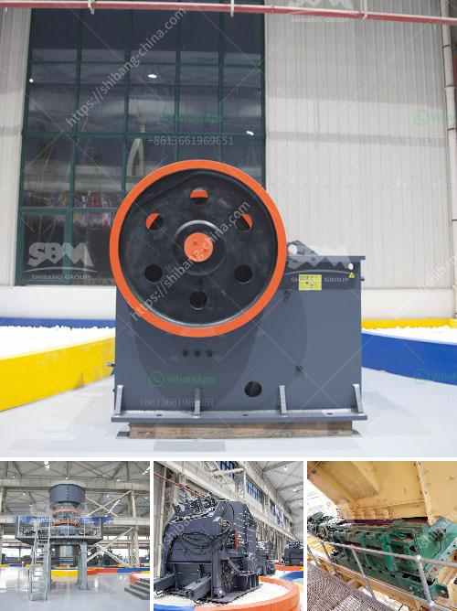

<h3>coal sludge rotary dryer supplier india</h3>
Coal sludge rotary dryer is developed based on the principle of minimizing environmental impact and energy consumption. It is designed to dry difficult to handle coal sludge and reduce its moisture content to less than 10%. The resulting dry coal can then be utilized for various applications such as fuel or feedstock in industries like cement, power plants, and steel manufacturing.

In India, where coal is a significant source of energy and a major contributor to greenhouse gas emissions, the need for efficient coal drying solutions is crucial. The coal sludge rotary dryer supplier in India plays a vital role in meeting this demand by providing innovative and eco-friendly drying solutions.

One of the leading coal sludge rotary dryer suppliers in India is (Company Name). With a dedicated team of engineers and technicians, they have developed a state-of-the-art rotary dryer that utilizes advanced technology and high-quality components. Their coal sludge rotary dryer is capable of handling large quantities of coal sludge and is highly efficient in reducing moisture content.

The dryer operates on the principle of direct or indirect heating, depending on the nature of the coal sludge and the desired moisture reduction. In direct heating, hot gases come into direct contact with the wet coal sludge, extracting moisture and evaporating it. In indirect heating, heat is transferred through the walls of the dryer, ensuring a controlled and uniform drying process.

The coal sludge rotary dryer supplier in India offers a range of drying capacities, ranging from a few tons per hour to larger industrial-scale dryers capable of handling hundreds of tons of coal sludge per day. The dryer is equipped with advanced control systems that allow for precise temperature and airflow control, ensuring optimal drying conditions and energy efficiency.

Apart from offering high-quality rotary dryers, the coal sludge dryer supplier also provides comprehensive after-sales service, including installation, maintenance, and technical support. Their team of experts is available to assist clients with any issues they may encounter during the installation or operation of the dryer.

By investing in a coal sludge rotary dryer from a reliable supplier, industries in India can benefit from significant cost savings and reduced environmental impact. The dryer enables them to utilize coal sludge that would otherwise be considered waste, thereby reducing the need for fresh coal and minimizing the impact on natural resources.

Furthermore, the dryer's efficient drying process helps reduce CO2 emissions, as coal sludge with lower moisture content requires less energy for combustion. This contributes to India's efforts in mitigating climate change and transitioning towards a more sustainable and clean energy future.

In conclusion, the coal sludge rotary dryer supplier in India plays a crucial role in providing innovative and eco-friendly drying solutions to industries heavily reliant on coal. Their high-quality rotary dryers offer efficient drying capabilities, reduce moisture content, and minimize environmental impact. By investing in these drying solutions, industries in India can achieve significant cost savings, reduce carbon emissions, and move towards a more sustainable energy future.
<h3>Contact us</h3><ul><li><strong>Whatsapp:&nbsp;<a href="https://wa.me/8613661969651">+8613661969651</a></strong></li><li><a href="https://swt.shibang-china.com/?git&amp;zhl&amp;coal sludge rotary dryer supplier india"><strong>Online Service(chat now)</strong></a></li></ul><h3>Related</h3><ul><li><a href='ballast crusher machine.md'>ballast crusher machine</a></li><li><a href='sand and gravel mining equipment for sale.md'>sand and gravel mining equipment for sale</a></li><li><a href='small rock crusher machine for sale.md'>small rock crusher machine for sale</a></li><li><a href='aggregates crusher plant for sale in south africa.md'>aggregates crusher plant for sale in south africa</a></li><li><a href='price 200 crusher price.md'>price 200 crusher price</a></li></ul>